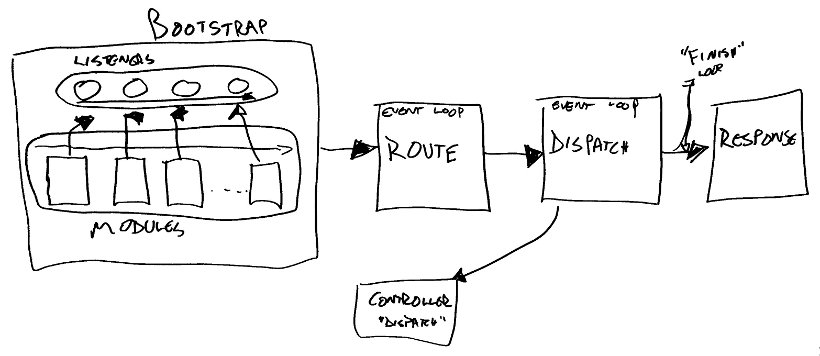
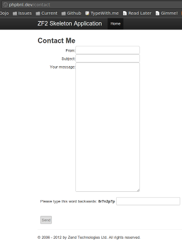

ZF2 Workshop
==========

.fx: titleslide

---

Our goal
----

.fx: centeredHeaders

Better consistency and performance.
----

---

How we'll get there
----

1. **Community**

Presenter Notes
----

Community has helped us identify the problems of ZF1, and also proposed and
provided solutions we're now using and incorporating into ZF2. We've had close
to 300 people make direct commits to ZF1, and close to 100 collaborators on ZF2
already. Our direction is now being driven by community proposals, IRC meetings,
and voting.

---

How we'll get there
----

1. Community
1. **Emphasis on SOLID principles**

Presenter Notes
----

* **S** ingle-responsibility principle
* **O** pen/closed principle, 
* **L** iskov substitution principle, 
* **I** nterface segregation principle, 
* **D** ependency inversion principle. 

---

How we'll get there
----

1. Community
1. Emphasis on SOLID principles
1. **Embrace the new features of PHP 5.3+**

Presenter Notes
----

We're using namespaces, autoloading, closures, late static binding, functors,
all the yumminess of SPL, even goto

---

How we'll get there
----

1. Community
1. Emphasis on SOLID principles
1. Utilize PHP 5.3+ to full advantage
1. **Fully utilize HTTP**

Presenter Notes
----

The HTTP specification is full of goodies, and we leverage it and code to it
with a redesigned HTTP component. This includes full encapsulation of HTTP
methods, headers, cookies, and more, and becomes the core of our new MVC layer.

---

A New Core
====

.fx: sectionslide

---

The ZF1 Way
----

.fx: centeredHeaders

Singletons, Registries, and Hard-Coded Dependencies

Presenter Notes
----

The main entry point to a ZF1 app was a singleton, Zend_Controller_Front.
Registries have long been promoted as a way to access dependencies, and are the
primary way i18n/l10n work. Controllers typically instantiated objects they
needed directly. It's a mess.

---

The ZF2 Way
----

.fx: centeredHeaders

Aspect Oriented Design and Dependency Injection

Presenter Notes
----

The two biggest questions as we've worked on ZF2 have centered around how
controllers could get their dependencies, and how to make systems flexible.
Tasks like logging, caching, and authorization should be simple to initiate.

---

Dependency Injection
====

---

Basic Dependency Injection
----

Dependency Injection is not magic.

    !php
    <?php
    class Bar {}

    class Foo
    {
        protected $bar;

        public function __construct(Bar $bar)
        {
            $this->bar = $bar;
        }
    }

---

Setter Injection
----

Sometimes we use setters.

    !php
    <?php
    class Foo
    {
        protected $bar;

        public function setBar(Bar $bar)
        {
            $this->bar = $bar;
        }
    }

---

It solves a problem
----

* How do we enforce a separation of concerns?

---

It creates a new problem
----

* How and when do we create and inject dependencies?

---

DI Containers
----

* Store object definitions, including dependency information
* Store environment-specific configuration of the dependencies
* Handle the creation of objects and their dependencies

---

Sample Definition
----

    !php
    <?php
    $definition = array(
        'Foo' => array(
            'setBar' => array(
                'bar' => array(
                    'type'     => 'Bar',
                    'required' => true,
                ),
            ),
        ),
    );

---

Using the DI Container
----

    !php
    <?php
    use Zend\Di\Di,
        Zend\Di\Configuration;

    $di     = new Di;
    $config = new Configuration(array(
        'definition' => array('class' => $definition)
    ));
    $config->configure($di);

    $foo = $di->get('Foo'); // contains Bar!

---

Typically configuration-driven
----

.fx: smaller-code

    !php
    <?php
    return array('di' => array('instance' => array(
        'Cache\Adapter\Memcached' => array('parameters' => array(
            'options' => 'Cache\Adapter\MemcachedOptions',
        )),

        'Cache\Adapter\MemcachedOptions' => array('parameters' => array(
            'options' => array(
                'namespace'       => 'cache_listener',
                'ttl'             => 60 * 60 * 24 * 7, // 1 week
                'server'          => '127.0.0.1',
                'port'            => 11211,
                'compression'     => true,
                'binary_protocol' => true,
                'no_block'        => true,
                'connect_timeout' => 100,
                'serializer'      => 3, // JSON
            ),
        )),
    )));

----

Multiple DI strategies
----

 * Runtime (using Reflection)
 * Compiled (pre-compile to classes)
 * Builder (programmatically create)
 * Annotation (hint to Runtime or Compiled strategies)

Presenter Notes
----

Annotation support is primarily to make interface injection possible.

----

Aspects, Signals and Events, oh my!
====

Presenter Notes
----

All similar concepts, with different nuances.

----

Terminology
------

* An *Event* is an _action_
* A *Listener* is a callback that responds to an _event_
* An *EventManager* is a collection of _listeners_ and _triggers_ events

---

In a Nutshell
----

    !php
    <?php
    use Zend\EventManager\EventManager;
    
    $events = new EventManager();
    
    $events->attach('do', function($e) {
        $event  = $e->getName();
        $params = $e->getParams();
        printf(
            'Handled event "%s", with parameters %s',
            $event,
            json_encode($params)
        );
    });
    
    $params = array('foo' => 'bar', 'baz' => 'bat');
    $events->trigger('do', null, $params);

---

Attach
----

* An event _name_ 
* The callback that will respond
* Optionally, the priority at which to listen

Presenter Notes
----

Priority allows doing pre/post style hooks

---

    !php
    <?php
    $events->attach('do', $callback);       // base priority
    $events->attach('do', $callback, 100);  // high priority
    $events->attach('do', $callback, -100); // low priority

---

Trigger
----

Typically:

* Event _name_
* Target (object or function triggering the event)
* Arguments

---

    !php
    <?php
    // instance method
    public function foo($bar, $baz)
    {
        $params = compact('bar', 'baz');
        $this->events()->trigger('do', $this, $params);
    }

---

Event
----

    !php
    <?php
    interface EventDescription
    {
        public function setName($name);
        public function setTarget($target);
        public function setParams($params);
        public function getName();
        public function getTarget();
        public function getParam($name, $default = null);
        public function getParams();
    }

---

Listeners
----

Listeners receive an _Event_ as their sole argument.

Listeners can be _any_ valid PHP callback.

---

    !php
    <?php
    function ($e) {
        $event  = $e->getName();
        $target = $e->getTarget();
        $target = (is_object($target) 
                ? get_class($target) 
                : gettype($target))
        $params = $e->getParams();
        printf(
            'Event "%s", params %s, target "%s"',
            $event,
            json_encode($params),
            $target
        );
    }

---

Digression: Custom Events
==========

---

Semantics matter.
=========

---

An Example of Bad Semantics
----

    !php
    <?php
    $callback = function($e) {
        $result  = $e->getParam('__RESULT__');
        $matches = $e->getParam('route-match');
        // ...
    };

---

Better Semantics
----

    !php
    <?php
    $callback = function($e) {
        $result  = $e->getResult();
        $matches = $e->getRouteMatch();
        // ...
    };

---

Creating Custom Events
----

Easiest is to simply extend Zend&#92;EventManager&#92;Event:

    !php
    <?php
    use Zend\EventManager\Event;

    class MyEvent extends Event
    {
        protected $result;

        public function setResult($result)
        {
            $this->setParam('result', $result);
        }

        public function getResult()
        {
            return $this->getParam('result');
        }
    }

Presenter Notes
----

Using built-in parameters makes martialling easier.

---

Using Custom Events: part 1
----

Pass as sole parameter:

    !php
    <?php
    $event = new MyEvent();
    $event->setName('foo');
    $event->setTarget($this);

    $events->trigger($event);

---

Using Custom Events: part 2
----

Pass as second parameter:

    !php
    <?php
    $event = new MyEvent();
    $event->setTarget($this);

    $events->trigger('foo', $event);

---

Using Custom Events: part 3
----

Pass as third parameter:

    !php
    <?php
    $event = new MyEvent();

    $events->trigger('foo', $this, $event);

---

Recommended Usage
===========

---

Compose an EventManager
----

.fx: smaller-code

    !php
    <?php
    use Zend\EventManager\EventCollection,
        Zend\EventManager\EventManager;
    class Foo
    {
        protected $events;
        public function setEventManager(EventCollection $events)
        {
            $this->events = $events;
        }
        public function events()
        {
            if (!$this->events) {
                $this->setEventManager(new EventManager(array(
                    __CLASS__, get_called_class(),
                ));
            }
            return $this->events;
        }
    }

Presenter Notes
----
This would make a great Trait

---

Trigger Events
----

.fx: smaller-code

    !php
    <?php
    class Foo
    {
        // ...
        
        public function bar($baz, $bat = null)
        {
            $params = compact($baz, $bat);
            $this->events()->trigger(__FUNCTION__, $this, $params);
        }
    }

---

Notes on Triggering
----

* Use the method name as the event.
    * If triggering more than one event, use dot-notation (e.g., "dispatch.pre",
      "dispatch.post").
* Pass all input to the method as parameters.

---

Aggregate Listeners
===========

---

Sometimes you'll want stateful listeners.
====

.fx: centeredHeaders

Presenter Notes
----
Examples might be composing object collaborators

---

Sometimes listeners fall under the same area of responsibility.
====

.fx: centeredHeaders

Presenter Notes
----
Example includes view listener in ZF2 - views, layouts, error pages

---

Aggregate Listeners
-----------

* Allow attaching and detaching many listeners at once
* Pass an aggregate to the event manager, or vice versa

---

Example
----

.fx: smaller-code

    !php
    <?php
    class LogEvents implements ListenerAggregate
    {
        protected $handlers = array();
        protected $log;

        public function __construct(Logger $log)
        {
            $this->log = $log;
        }

        public function log(Event $e)
        {
            $event  = $e->getName();
            $params = $e->getParams();
            $log->info(sprintf('%s: %s', $event, json_encode($params)));
        }

        // ...
    }

---

Aggregate Functionality
-------

.fx: smaller-code

    !php
    <?php
    public function attach(EventCollection $events)
    {
        $this->handlers[] = $events->attach('do', array($this, 'log'));
        $this->handlers[] = $events->attach('doSomethingElse', array($this, 'log'));
    }

    public function detach(EventCollection $events)
    {
        foreach ($this->handlers as $key => $handler) {
            $events->detach($handler);
            unset($this->handlers[$key];
        }
        $this->handlers = array();
    }

---

Using Aggregates
----------

    !php
    <?php
    $logEvents = new LogEvents($logger);
    $events->attach($logEvents);

    // or
    $logEvents->attach($events);

---

Attaching Listeners Globally
============

---

Why?
----

* Listeners are often used for _cross-cutting concerns_.
* Often, you'll want to setup listeners early, before you have access to
  specific event manager instances.
* E.g., logging, debugging, caching.

---

How?
----

Use the StaticEventManager.

    !php
    <?php
    use Zend\EventManager\StaticEventManager;
    $events = StaticEventManager::getInstance();
    $events->attach($context, $event, $callback);

---

What is the "context"?
----

* Each EventManager instance can listen on one or more contexts
    * Provided to the constructor
    * Alternately added using `setIdentifier()`
* When triggering events, checks to see if any listeners were registered for its
  contexts with the StaticEventManager
* You can disable this at any time!

---

Example
----

    !php
    <?php
    use Zend\EventManager\StaticEventManager;
    $events = StaticEventManager::getInstance();
    $events->attach('Foo', 'bar', function ($e) {
        $event  = $e->getName();
        $target = $e->getTarget();
        $params = json_encode($e->getParams());
        sprintf('%s::%s: %s', $event, $target, $params);
    });

---

Advanced Topics
=======

---

Short Circuiting
====

---

What?
----

* Sometimes you may want to return early based on what a listener does
* Sometimes a listener may want to prevent other listeners from processing

---

How?
----

**Method 1:** Attach a callback when triggering

    !php
    <?php
    $results = $events->trigger($event, function($r) {
        return ($r instanceof Response);
    });

---

How?
----

**Method 2:** Signal from a listener

    !php
    <?php
    $listener = function ($e) {
        $e->stopPropagation(true);
    };

Presenter Notes
----
This is like JavaScript

---

Testing for stopped propagation
----

    !php
    <?php
    $results = $events->trigger(/* ... */);
    if ($results->stopped()) {
        return $results->last();
    }

---

Introspecting results
======

---

Iterate:
---

    !php
    <?php
    foreach ($results as $result) {
        // ...
    }

---

First result:
---

    !php
    <?php
    $first = $results->first();

---

Last result:
---

    !php
    <?php
    $first = $results->last();

---

Test for specific value:
----

    !php
    <?php
    if ($results->contains('foo')) {
        // found!
    }

---

Prioritized Events
=====

---

Why?
----

Sometimes events need to execute in a given order.

Presenter Notes
----
Examples: ACLs, caching

---

How?
----

* Optional final argument to attach() (even statically)
* Default priority is 1
* Higher values == higher priority
* Negative values == lower priority

---

Examples
----

    !php
    <?php
    // High priority:
    $events->attach('foo', $listener, 100);

    // Low priority:
    $events->attach('foo', $listener, -100);

---

Putting it Together
============

---

Our target
----

.fx: smaller-code

    !php
    <?php
    public function someExpensiveCall($criteria1, $criteria2)
    {
        $params  = compact('criteria1', 'criteria2');
        $results = $this->events()->trigger(
            __FUNCTION__ . '.pre', $this, $params, function ($r) {
            return ($r instanceof SomeResultClass);
        });
        if ($results->stopped()) {
            return $results->last();
        }
        
        // ... do some work ...
        
        /* $params['__RESULT__'] = $calculatedResult; */
        $this->events()->trigger(
            __FUNCTION__ . '.post', $this, $params);
        return $calculatedResult;
    }

---

Caching: check for match
----

.fx: smaller-code

    !php
    <?php
    $events->attach('someExpensiveCall.pre', function($e) use ($cache) {
        $params = $e->getParams();
        $key    = md5(json_encode($params));
        if (false !== ($hit = $cache->load($key)) {
            return $hit;
        }
    }, 100);

---

Caching: cache a value
----

.fx: smaller-code

    !php
    <?php
    $events->attach('someExpensiveCall.post', function($e) use ($cache) {
        $params = $e->getParams();
        $result = $params['__RESULT__'];
        unset($params['__RESULT__']);
        $key    = md5(json_encode($params));
        $cache->save($result, $key);
    }, -100);

----

Summary
----

Use the EventManager. It's powerful. It's the basis of our Application
architecture.

----

MVC
====

Presenter Notes
----
I'm going to show you the MVC from the inside out, using a flow
diagram to detail how it works.

----

In a nutshell...
----

----

From the inside out
----

* Dispatchable interface
  * Request and Response objects
  * View Models
* Routing
  * Route types
  * Tree routes
* Modules
* Bootstrapping

----

Controllers and HTTP
====

Presenter Notes
----
* We'll now detail the dispatchable interface, basic controllers, the
  request/response/header objects, and view models

----

Zend\\Stdlib\\Dispatchable
----

    !php
    <?php
    namespace Zend\Stdlib;

    interface Dispatchable
    {
        public function dispatch(
            RequestDescription $request, 
            ResponseDescription $response = null);
    }

Presenter Notes
----

It's so simple and obvious. It can be used by servers to accept requests and
return responses, or by clients, to send requests, and parse responses.

---

Use Cases for Dispatchables
----

* Strategy/Command patterns
* Server classes
* HTTP clients
* **MVC applications**

Presenter Notes
----

One thing interesting about the MVC is that because the same base is used for
server classes and general Strategies or Commands, these, too, can be attached
to the MVC directly, with little or no extra overhead.

---

Most basic controller
----

    !php
    <?php
    namespace Foo\Controller;

    use Zend\Stdlib\Dispatchable,
        Zend\Stdlib\RequestDescription as Request,
        Zend\Stdlib\ResponseDescription as Response;

    class MyController implements Dispatchable
    {
        public function dispatch(
            Request $request, Response $response = null
        ) {
            // do something and return a Response object
        }
    }

---

Typical Controller
----

.fx: smaller-code

    !php
    <?php
    namespace Foo\Controller;

    use Zend\Mvc\Controller\ActionController;

    class HelloController extends ActionController
    {
        public function worldAction()
        {
            $routeMatch = $this->getEvent()->getRouteMatch()
            $post       = $this->request->post();
            return array(
                'target'  => $routeMatch->getParam('target'),
                'message' => $post->get('message', 'Nobody'),
            );
        }
    }

Presenter Notes
----

* Looks a lot like ZF1
* Has an explicit return -- easier to test
* Inject dependencies via setters or constructor params
* We also have a "RestfulController"

---

Proposed View Layer
----

.fx: smaller-code

    !php
    <?php
    namespace Foo\Controller;

    use Zend\Mvc\Controller\ActionController,
        Zend\View\Model\ViewModel;

    class HelloController extends ActionController
    {
        public function worldAction()
        {
            $routeMatch = $this->getEvent()->getRouteMatch()
            $post       = $this->request->post();
            return new ViewModel(array(
                'target'  => $routeMatch->getParam('target'),
                'message' => $post->get('message', 'Nobody'),
            ), array(
                'template' => 'foo/hello',
            );
        }
    }

Presenter Notes
----

* Returning an explicit View Model

----

Request Object
----

    !php
    <?php
    $request->query();   // $_GET
    $request->post();    // $_POST
    $request->env();     // $_ENV
    $request->server();  // $_SERVER
    $request->file();    // $_FILES
    $request->cookie();  // $_COOKIE
    $request->uri();     // URI object
    $request->headers(); // headers

Presenter Notes
----
* Has test methods for request method
* Everything is mockable

----

Response Object
----

    !php
    <?php
    $response->setStatusCode($code); // Status
    $response->headers();            // headers
    $response->setContent($content); // body

Presenter Notes
----
* Allows easy manipulation of all aspects of response

----

Headers
----

    !php
    <?php
    $headers->addHeaderLine($header, $value); // set
    $headers->has($header);                   // test
    $headers->get($header);                   // get
    $header->getFieldValue();                 // get value

Presenter Notes
----
* Many header types have specific APIs -- e.g., Accept header

----

View Models
----

* Aggregate variables to expose
* Aggregate renderer options

----

View Model: Example
----

    !php
    <?php
    $model = new ViewModel();
    $model->setVariable($name, $value);
    $model->setVariables($array);
    $model->getVariables();
    $model->setOption($name, $value);
    $model->setOptions($array);
    $model->getOptions();

----

Context-Specific View Models
----

* `JsonViewModel`
* `FeedViewModel`

Presenter Notes
----
* These will typically not do much, but they _will_ allow you to typehint and
  develop rendering strategies.

----

Routing Requests
====

----

Routing
----

.fx: centeredHeaders

The act of matching a Request 

to a Controller.

---

Types of routes
----

* **Literal:** `"/contact"`
* **Segment:** `"/article/:id"`
* **Regex:** `"/tag/(?<tag>[^/]+)"`
* **Part/TreeRouteStack:** tree of routes
* **Wildcard:** `"/*"`
* **Hostname** 
* **Scheme** 

---

TreeRouteStack Example
----

    /blog -- Literal 
        .xml -- Literal ("/blog.xml")
        /(?<id>[^/]+) -- Regex ("/blog/foo")
        /tag/(?<tag>[^/.]+) -- Regex ("/blog/tag/foo")
            .xml -- Literal ("/blog/tag/foo.xml")
        /year/:year -- Segment ("/blog/year/2011")
        /month/:year/:month -- Segment ("/blog/month/2011/12")

Presenter Notes
---
* Any given route can indicate if it can terminate, or if additional segments
  are required
* Any given route may have child routes
* Each route gets full configuration for its type

---

Routing
---

A matched route **MUST** return a controller

    !php
    <?php
    use Zend\Mvc\Router\Http\Regex as RegexRoute;
    $route = new RegexRoute(
        '/blog/(?<id>[/.]+)', 
        '/blog/%id%', 
        array(
            'controller' => 'Blog\Controller\EntryController'
        )
    );

Presenter Notes
---
* Controller is what the Application is trying to _dispatch_
* Can be the class name (recommended) or an alias
* Anything else returned is up to the developer -- "action" is not necessary, as
  your controller defines what to do based on the Request and RouteMatch

---

A note on RouteMatch-es
----

Routes return a `RouteMatch` object on success

    !php
    <?php
    namespace Zend\Mvc\Router;

    class RouteMatch
    {
        public function getMatchedRouteName();
        public function getParams();
        public function getParam($name, $default = null);
    }

Presenter Notes
----
* This allows you to pull out anything matched by the route.
* Routes part of a TreeRoute will contain all matched parameters.
* Note that tree routes are designated using "/" separator between segments

---

Modular MVC Applications
====

Presenter Notes
----
What provides us with controllers and routes?

The answer is: modules

---

What is a module?
====

Presenter Notes
----
* Problem with ZF1: no re-use and sharing, due to architecture
* ZF2's goal: share and collaborate
* A module is a complete solution to a discrete problem or set of related
  problems

----

Modules in ZF2
----

* A **namespace**,
* containing a single classfile, a **Module**

Presenter Notes
----

* Structure is left to the developer, though we have a _recommended_ structure
* We have a few interfaces you can implement that hint to the module manager how
  a module can be _used_

---

Modules can contain...
----

* PHP code, _including MVC code_
* Assets, such as CSS, JS, and images
* Unit tests
* Documentation
* _Anything_

Presenter Notes
----

I've created a module that simply provided SkeletonCSS in a way that I could
easily drop it into a project. I have modules that are basically libraries, and
contain source code, unit tests, and documentation. The point is, they can
provide just about anything, because the only requirement is the Module class as
an entry point.

---

At the most basic...
----

    module/
        Foo/
            Module.php

---

The module class...
----

Which contains:

    !php
    <?php
    namespace Foo;

    class Module { }

Presenter Notes
----

* That's really it. It's a single entry point, and completely opt-in.

---

Recommended module structure
----

    ModuleName/
        autoload_classmap.php
        Module.php
        config/
            module.config.php
        public/
            css/
            images/
            js/
        src/
            ModuleName/
                ... code ...
        test/
            ModuleName/
                ... code ...
        view/
            ... templates, etc. ...

Presenter Notes
----
* I mentioned before they can contain anything. We have a recommended structure
  to answer the question of "where do I put X, Y, or Z?"
* Discuss some of the reasons behind the decisions

----

Modules typically provide...
----

* Autoloading artifacts
* Basic configuration
* Event listener registration

Presenter Notes
----

Commonly, we will provide DI and routing configuration.

---

Providing autoloading hints
----

    !php
    <?php
    namespace Foo;
    use Zend\Module\Consumer\AutoloaderProvider;
    class Module implements AutoloaderProvider
    {
        public function getAutoloaderConfig()
        {
          return array(
            'Zend\Loader\ClassMapAutoloader' => array(
              include __DIR__ . '/autoload_classmap.php',
            ),
            'Zend\Loader\StandardAutoloader' => array(
              'namespaces' => array(
                'Foo' => __DIR__ . '/src/Foo',
              ),
            ),
          );
        }
    }

Presenter Notes
----

* Basically, returning a configuration array to pass to the AutoloaderFactory.
  This ensures re-use of the same autoloader objects, but also means that the
  AutoloaderListener will be able to cache this configuration for later use.

---

Providing configuration
----

    !php
    <?php
    namespace Foo;

    class Module
    {
        public function getConfig()
        {
            return include __DIR__ 
                    . '/config/module.config.php';
        }
    }

Presenter Notes
----

* The config listener merges this configuration with the config it stores
  internally.

---

Example module configuration
----

    !php
    <?php
    return array(
        'routes' => array( /* ... */ ),
        'di'     => array( /* ... */ ),
    );

Presenter Notes
----
* Note lack of environments; we do envs via glob merging

---

Event registration (post-init tasks)
----

    !php
    <?php
    namespace Foo;
    use Zend\EventManager\StaticEventManager,
        Zend\Module\Manager as ModuleManager;
    class Module
    {
        public function init(ModuleManager $manager)
        {
            $events = StaticEventManager::getInstance();
            $events->attach(
                'bootstrap', 'bootstrap', 
                array($this, 'bootstrap')
            );
        }

        public function bootstrap($e)
        {
            $app    = $e->getParam('application');
            // do some stuff...
        }
    }

Presenter Notes
----

* a special "InitTrigger" listener will call init() if it exists
* this is a good place to register events
* shows execution order: module manager aggregates items and triggers events; we
  then execute the bootstrap, which triggers other events; and then we run the
  application
* Event at bootstrap knows about the application, config, and module manager

----

Bootstrapping and Application Running
====

Presenter Notes
----

We've reached the skin of the onion finally -- we'll now put it together.

----

Bootstrapping
----

* An `Application`: 
  * composes configuration, a router, a locator, and an event manager.
  * triggers events (`route`, `dispatch`, and `finish`).
* Modules provide: 
  * configuration, which includes routes and locator information
  * event listeners.
* Bootstrapping 
  * aggregates information from modules 
  * provides aggregated information to the application

Presenter Notes
----

The second point is incredibly important. It means that if you want to provide
alternate strategies for routing or dispatch, all you need to do is replace
the listeners on those events.

---

Putting it together: index.php
----

.fx: smaller-code

    !php
    <?php
    $appConfig = include __DIR__ . '/../config/application.config.php';

    $moduleLoader = new ModuleAutoloader($appConfig['module_paths']);
    $moduleLoader->register();

    $moduleManager = new Manager($appConfig['modules']);
    $moduleManager
        ->getConfigListener()
        ->addConfigGlobPath(__DIR__ . '/config/autoload/*.{global,local}.config.php');
    $moduleManager->loadModules();
    $config = $moduleManager->getMergedConfig();

    // Create application, bootstrap, and run
    $bootstrap   = new Bootstrap($config);
    $application = new Application;
    $bootstrap->bootstrap($application);
    $application->run()->send();

Presenter Notes
----

* Loops through modules, grabbing configuration
* Merges in local configuration (addConfigGlobPath())
* Bootstraps from configuration
* Executes application

---

What about the V, View?
----

.fx: smaller-code

When is view rendering happening? via an Event Listener (as of beta2):

    !php
    <?php
    use Zend\EventManager\EventCollection as Events,
        Zend\EventManager\ListenerAggregate;

    class ViewListener implements ListenerAggregate
    {
        /* ... */

        public function attach(Events $events)
        {
            $events->attach('dispatch', 
                array($this, 'renderView', -100);
            $events->attach('dispatch', 
                array($this, 'renderLayout', -1000);
        }

        /* ... */
    }

Presenter Notes
----

** NOTE**: Update this to be a preview of the new View system
* Low priority listeners, layout happening magnitudes later than view
* We'll be formalizing this later
  * Discuss the concept of a "ViewResult" type of object

---

Getting Your Hands Dirty: Contact!
====

Presenter Notes
----
The idea now is to take the information we've got, and build a new module for
the skeleton app I've handed around. We'll configure a mail transport and mail
message, pass them into a controller, and do something with it all.

----

The goal:
----

* Display a contact form
* Validate the contact form, and re-display if necessary
* Send an email via a configured mail transport, and display a "thank you" page

----

To begin:
----

    !sh
    cd ZendSkeletonApplication
    mkdir module/PhpbnlContact
    cd module/PhpbnlContact
    mkdir -p config src/PhpbnlContact view/contact

Presenter Notes
----
This sets up the basic structure we need for the files we'll be creating.

----

Routes: Base route
----

.fx: smaller-code

    !php
    <?php
    // module/PhpbnlContact/config/module.config.php
    return array(
      'routes' => array(
        'contact' => array(
          'type' => 'Literal',
          'options' => array(
            'route' => '/contact',
            'defaults' => array(
              'controller' => 'contact',
              'action'     => 'index',
            ),
          ),
          'may_terminate' => true,
          'child_routes' => array(/* ... */),
        ),
      ),
    );

----

Routes: Process form
----

.fx: smaller-code

    !php
    <?php
    /* this is a child route */
    'process' => array(
      'type' => 'Literal',
      'options' => array(
        'route' => '/process',
        'defaults' => array(
          'controller' => 'contact',
          'action'     => 'process',
        ),
      ),
    ),

----

Routes: Thank you page
----

.fx: smaller-code

    !php
    <?php
    /* this is a child route */
    'thank-you' => array(
      'type' => 'Literal',
      'options' => array(
        'route' => '/thank-you',
        'defaults' => array(
          'controller' => 'contact',
          'action'     => 'thank-you',
        ),
      ),
    ),

----

Defining the form
----

* Email
* Subject
* Body
* Captcha
* CSRF-protection
* Submit button

----

Contact Form
----

.fx: smaller-code

    !php
    <?php
    // module/PhpbnlContact/src/PhpbnlContact/ContactForm.php
    namespace PhpbnlContact;
    
    use Zend\Captcha\Adapter as CaptchaAdapter,
        Zend\Form\Form,
        Zend\Validator\Hostname as HostnameValidator;
    
    class ContactForm extends Form
    {
        protected $captchaAdapter;
    
        public function __construct($captchaAdapter = null)
        {
            if ($options instanceof CaptchaAdapter) {
                $this->setCaptchaAdapter($captchaAdapter);
                parent::__construct(null);
                return;
            };
    
            parent::__construct($captchaAdapterj);
        }
        /\* ... \*/

----

Contact Form
----

.fx: smaller-code

    !php
    <?php
    namespace PhpbnlContact;
    
    use Zend\Captcha\Adapter as CaptchaAdapter,
        Zend\Form\Form,
        Zend\Validator\Hostname as HostnameValidator;
    
    class ContactForm extends Form
    {
        /\* ... \*/
        public function setCaptchaAdapter(CaptchaAdapter $captcha)
        {
            $this->captchaAdapter = $captcha;
        }
        /\* ... \*/

----

Contact Form
----

.fx: smaller-code

    !php
    <?php
    namespace PhpbnlContact;
    
    use Zend\Captcha\ReCaptcha,
        Zend\Form\Form,
        Zend\Validator\Hostname as HostnameValidator;
    
    class ContactForm extends Form
    {
        public function init()
        {
            /\* setup all elements \*/
            $this->addElement('captcha', 'captcha', array(
                'required'       => true,
                'captcha'        => $this->captchaAdapter,
            ));
            /\* finish setting up \*/
        }

----

Controller: Dependencies
----

.fx: smaller-code

    !php
    <?php
    namespace PhpbnlContact;

    use Zend\Mail\Transport,
        Zend\Mail\Message as Message,
        Zend\Mvc\Controller\ActionController;

    class ContactController extends ActionController
    {
        protected $form;
        protected $message;
        protected $transport;

        public function setMessage(Message $message)
        {
            $this->message = $message;
        }

        public function setMailTransport(Transport $transport)
        {
            $this->transport = $transport;
        }

        public function setContactForm(ContactForm $form)
        {
            $this->form = $form;
        }

----

Controller: Display form
----

    !php
    <?php
    public function indexAction()
    {
        return array('form' => $this->form);
    }

----

Controller: Process form
----

.fx: smaller-code

    !php
    <?php
    public function processAction()
    {
        if (!$this->request->isPost()) {
            $this->response->setStatusCode(302);
            $this->response->headers()
                 ->addHeaderLine('Location', '/contact');
        }
        $post = $this->request->post()->toArray();
        $form = $this->form;
        if (!$form->isValid($post)) {
            $this->getEvent()->getRouteMatch()
                             ->setParam('action', 'index');
            return array(
                'error' => true,
                'form'  => $form
            );
        }

        // send email...
        $this->sendEmail($form->getValues());

        return $this->redirect()->toRoute('contact/thank-you');
    }

----

Controller: Send email
----

.fx: smaller-code

    !php
    <?php
    protected function sendEmail(array $data)
    {
        $from    = $data['from'];
        $subject = '[Contact Form] ' . $data['subject'];
        $body    = $data['body'];

        $this->message->addFrom($from)
                      ->addReplyTo($from)
                      ->setSubject($subject)
                      ->setBody($body);
        $this->transport->send($this->message);
    }

----

Controller: Thank you page
----

.fx: smaller-code

    !php
    <?php
    public function thankYouAction()
    {
        $headers = $this->request->headers();
        if (!$headers->has('Referer')
            || !preg_match('#/contact/process$#',
                  $headers->get('Referer')->getFieldValue())
        ) {
            $this->response->setStatusCode(302);
            $this->response->headers()
                 ->addHeaderLine('Location', '/contact');
        }

        // do nothing...
    }

----

Add view scripts: Form
----

.fx: smaller-code

    !php
    <?php
    // module/PhpbnlContact/view/contact/index.phtml
    $this->headTitle()->prepend('Contact'); ?>
    <section class="contact">
    <h2>Contact Me</h2>

    <?php if ($this->error): ?>
    

        There were one or more isues with your submission. Please correct them
        as indicated below.
    

    <?php endif ?>

    <?php 
    $form = $this->form;
    $form->setAction($this->url('contact/process'));
    $form->setMethod('post');
    echo $form->render($this);

----

Add view scripts: Thank You
----

    !php
    <?php
    // module/PhpbnlContact/view/contact/thank-you.phtml
    $this->headTitle()->prepend('Contact');
    $this->headTitle()->prepend('Thank You!');
    ?>
    <section class="contact">
    <h2>Thank you!</h2>

    

        Your message has been sent!
    

    </section>

----

DI Definitions: Controller/Form
----

.fx: smaller-code

    !php
    <?php
    /* inside module/PhpbnlContact/config/module.config.php */
    'di' => array(
        'definition' => array('class' => array(
            'PhpbnlContact\ContactController' => array(
                'setContactForm' => array(
                    'form' => array(
                        'required' => true,
                        'type'     => 'PhpbnlContact\ContactForm',
                    ),
                ),
            ),
            'PhpbnlContact\ContactForm' => array(
                '__construct' => array(
                    'captchaAdapter' => array(
                        'required' => true,
                        'type'     => 'Zend\Captcha\Adapter',
                    ),
                ),
            ),
        )),
    ),

----

DI Definitions: Message 
----

.fx: smaller-code

    !php
    <?php
    /* inside module/PhpbnlContact/config/module.config.php,
       in the di -> definition array */
    'Zend\Mail\Message' => array(
        'addTo' => array(
            'emailOrAddressList' => array(
                'type' => false, 'required' => true),
            'name' => array('type' => false, 'required' => false),
        ),
        'addFrom' => array(
            'emailOrAddressList' => array(
                'type' => false, 'required' => true),
            'name' => array('type' => false, 'required' => false),
        ),
        'setSender' => array(
            'emailOrAddressList' => array(
                'type' => false, 'required' => true),
            'name' => array('type' => false, 'required' => false),
        ),
    ),

----

DI Preferences and aliases
----

.fx: smaller-code

    !php
    <?php
    /* inside module/PhpbnlContact/config/module.config.php,
       in the "di" array */
      'preferences' => array(
        'Zend\Captcha\Adapter' => 'Zend\Captcha\Dumb',
        'Zend\Mail\Transport'  => 'Zend\Mail\Transport\Smtp',
      ),
      'instance' => array(
        'alias' => array(
            'contact' => 'PhpbnlContact\ContactController',
        ),
      ),
    );

Presenter Notes
----

* We're telling DI that when a Transport is requested, use an SMTP transport
* We're aliasing "contact" to the contact controller

----

DI Configuration: Controller/Form
----

    !php
    <?php
    /* inside module/PhpbnlContact/config/module.config.php,
       in the "di -> instance" array */
    'contact' => array('parameters' => array(
        'form' => 'PhpbnlContact\ContactForm',
    )),

Presenter Notes
----

* Alias is used for controller name
* If the controller is pulled, so are its dependencies.
* We tell it the preferred Transport
* and how to configure it

----

DI Configuration: View scripts
----

    !php
    <?php
    return array('di' => array(
    /* inside module/PhpbnlContact/config/module.config.php,
       in the "di -> instance" array */
    'Zend\View\PhpRenderer' => array('parameters' => array(
        'options' => array(
            'script_paths' => array(
                'contact' => __DIR__ . '/../view',
            ),
        ),
    )),

----

Create an autoloader map
----

    !sh
    cd module/PhpbnlContact
    php ../../vendor/ZendFramework/bin/classmap_generator.php \
    -l ./src \
    -o ./autoload_classmap.php

Presenter Notes
----
Creates "autoload_classmap.php" file in module root

----

Module class: autoloading
----

.fx: smaller-code

    !php
    <?php
    // module/PhpbnlContact/Module.php
    namespace PhpbnlContact;

    use Zend\Module\Consumer\AutoloaderProvider;

    class Module implements AutoloaderProvider
    {
      public function getAutoloaderConfig()
      {
        return array(
          'Zend\Loader\ClassMapAutoloader' => array(
            __DIR__ . '/autoload_classmap.php'
          ),
          'Zend\Loader\StandardAutoloader' => array(
            'namespaces' => array(
              'PhpbnlContact' => __DIR__ . '/src/PhpbnlContact',
            ),
          ),
        );
      }
      /* ... */

----

Module class: configuration
----

.fx: smaller-code

    !php
    <?php
    namespace PhpbnlContact;

    use Zend\Module\Consumer\AutoloaderProvider;

    class Module implements AutoloaderProvider
    {
      /* ... */

      public function getConfig()
      {
        return include __DIR__ . '/config/module.config.php';
      }
    }

----

Add application configuration
----

.fx: smaller-code

    !php
    <?php
    // config/autoload/module.phpbnl-contact.config.php
    return array('di' => array(
      'preferences' => array(
        'Zend\Mail\Transport' => 'Zend\Mail\Transport\File',
      )
      'instance' => array(
        'contact' => array('parameters' => array(
          'transport' => 'Zend\Mail\Transport\File',
        ))
        'PhpbnlContact\ContactForm' => array('parameters' => array(
          'captchaAdapter'  => 'Zend\Captcha\Dumb',
        ),
        'Zend\Mail\Transport\FileOptions' => array('parameters' => array(
          'path' => sys_get_temp_dir(),
        )),
        'Zend\Mail\Message' => array('parameters' => array(
          'Zend\Mail\Message::addTo:emailOrAddressList' => 'me@mwop.net',
          'Zend\Mail\Message::setSender:emailOrAddressList' => 'me@mwop.net',
        )),
      )),
    );

----

Add the module to the app
----

    !php
    <?php
    // config/application.config.php
    /* ... */
    'modules' => array(
        'Application',
        'PhpbnlContact', // <- add this
    ),
    'module_listener_options' => array( /* ... */)
    /* ... */

----

Visit the page
----

http://phpbnl.dev/contact

----

Review
----

* We created routes
* We created a form (kind of!)
* We created a controller, with end points for landing, processing, and
  displaying a thank you page
* We created the necessary views
* We setup DI configuration for our form
* We setup DI configuration for the mail transport and message
* We created an autoloader classmap
* We created a Module class for our module
* We added the module to the application

----

Wrapping Up
====

---

When?
----

* Beta 1 and Beta 2: 
    * http://packages.zendframework.com/
* Beta 3:
    * End of February
* New Betas around every six weeks, until we're done.
* Stable:
    * ? _(likely Summer 2012)_

Presenter Notes
----

* We're doing gmail style betas. We *want* you to play with the code. We think
  it's compelling, and going to change the way you develop applications.
* This also means that our betas are going to introduce changes. We'll work hard
  to minimize them, but be prepared. But build with it!
* Beta3 is focussing on the view layer, DB, and console tooling

---

Resources
----

* Bundle o' links! 
    * http://bit.ly/rzOOge
* The ZF2 subsite
    * http://framework.zend.com/zf2
* My "mwop.net" site repository
    * http://git.mwop.net/?a=summary&p=zf2sandbox

---

Helping out
----

* http://framework.zend.com/zf2
* https://github.com/zendframework
* Bi-weekly IRC meetings (#zf2-meeting on Freenode IRC)
* \#zftalk.2 on Freenode IRC

Presenter Notes
----

* Read our Git guide, NO CLA REQUIRED, blah, blah, blah

---

Thank You!
====

* Feedback?
    * http://framework.zend.com/
    * http://twitter.com/weierophinney
