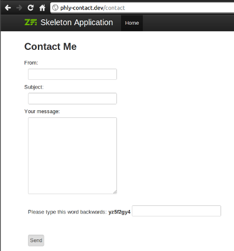

Writing Reusable ZF2 Modules
==========

.fx: titleslide

Presenter Notes
----
What provides us with controllers and routes?

The answer is: modules

* what is a module, and why?
* basic structure
* the module class
* hooking into bootstrapping

---

What is a module?
====

Presenter Notes
----
* Problem with ZF1: no reuse and sharing, due to architecture
* ZF2's goal: share and collaborate
* A module is a complete solution to a discrete problem or set of related
  problems

----

Modules in ZF2
----

* A **namespace**,
* containing a single classfile, a **Module**

Presenter Notes
----

* Structure is left to the developer, though we have a _recommended_ structure
* We have a few interfaces you can implement that hint to the module manager how
  a module can be _used_

---

Modules can contain...
----

* PHP code, _including MVC code_
* Assets, such as CSS, JS, and images
* Unit tests
* Documentation
* _Anything_

Presenter Notes
----

I've created a module that simply provided SkeletonCSS in a way that I could
easily drop it into a project. I have modules that are basically libraries, and
contain source code, unit tests, and documentation. The point is, they can
provide just about anything, because the only requirement is the Module class as
an entry point.

---

At the most basic...
----

    module/
        Foo/
            Module.php

---

The module class...
----

Which contains:

    !php
    <?php
    namespace Foo;

    class Module { }

Presenter Notes
----

* That's really it. It's a single entry point, and completely opt-in.

---

Recommended module structure
----

    ModuleName/
        Module.php
        config/
            module.config.php
        public/
            css/
            images/
            js/
        src/
            ModuleName/
                ... code ...
        test/
            ModuleName/
                ... code ...
        view/
            ... templates, etc. ...

Presenter Notes
----
* I mentioned before they can contain anything. We have a recommended structure
  to answer the question of "where do I put X, Y, or Z?"
* Discuss some of the reasons behind the decisions

----

Modules typically provide...
----

* Autoloading artifacts
* Basic configuration, including routes
* Event listener registration

Presenter Notes
----

Commonly, we will provide DI and routing configuration.

---

Providing autoloading hints
----

    !php
    <?php
    namespace Foo;
    use Zend\Module\Consumer\AutoloaderProvider;
    class Module implements AutoloaderProvider
    {
        public function getAutoloaderConfig()
        {
          return array(
            'Zend\Loader\ClassMapAutoloader' => array(
              include __DIR__ . '/autoload_classmap.php',
            ),
            'Zend\Loader\StandardAutoloader' => array(
              'namespaces' => array(
                'Foo' => __DIR__ . '/src/Foo',
              ),
            ),
          );
        }
    }

Presenter Notes
----

* Basically, returning a configuration array to pass to the AutoloaderFactory.
  This ensures reuse of the same autoloader objects, but also means that the
  AutoloaderListener will be able to cache this configuration for later use.

---

Providing configuration
----

    !php
    <?php
    namespace Foo;

    class Module
    {
        public function getConfig()
        {
            return include __DIR__ 
                    . '/config/module.config.php';
        }
    }

Presenter Notes
----

* The config listener merges this configuration with the config it stores
  internally.
* You can also use other config formats. Just return an array or Traversable
  object

---

Typical module configuration
----

    !php
    <?php
    return array('di' => array(
      'instance' => array(
        'Zend\Mvc\Router\RouteStack' => array('parameters' => array(
          'routes' => array(
            'foo' => array(
              'type' => 'Literal',
              'options' => array(
                'route' => '/foo',
                'defaults' => array(
                  'controller' => 'Foo\Controller\IndexController',
                ),
              ),
              'may_terminate' => true,
              'child_routes' => aray( /* ... */ ),
    )))))));

Presenter Notes
----
* Note lack of environments; we do envs via glob merging
* base root! This allows us to override the base route in order to provide an
  alternate starting segment to our module's routes

---

Event registration (post-init tasks)
----

    !php
    <?php
    namespace Foo;
    use Zend\EventManager\StaticEventManager,
        Zend\Module\Manager as ModuleManager;
    class Module
    {
        public function init(ModuleManager $manager)
        {
            $events = StaticEventManager::getInstance();
            $events->attach(
                'bootstrap', 'bootstrap', 
                array($this, 'bootstrap')
            );
        }

        public function bootstrap($e)
        {
            $app    = $e->getParam('application');
            // do some stuff...
            // Often, registering other listeners
        }
    }

Presenter Notes
----

* a special "InitTrigger" listener will call init() if it exists
* this is a good place to register events
* shows execution order: module manager aggregates items and triggers events; we
  then execute the bootstrap, which triggers other events; and then we run the
  application
* Event at bootstrap knows about the application, config, and module manager

----

Module-specific Event Listeners
----

.fx: smaller-code

    !php
    <?php
    namespace Foo;
    /* ... */
    class Module
    {
        /* ... */
        public function bootstrap($e)
        {
            $app    = $e->getParam('application');
            $app->events()->attach('route', array($this, 'moduleCheck'), -100);
        }

        public function moduleCheck($e)
        {
            $matches = $e->getRouteMatch();
            $controller = $matches->getParam('controller', '');
            if (0 !== strpos($controller, __NAMESPACE__)) {
                // Not our module
                return;
            }

            // Do cool stuff!
        }
    }

Presenter Notes
----

* This allows attaching module-specific listeners, or doing module-specific
  initialization. Since $e is the MvcEvent, and triggered by the Application,
  this gives us access to the application, configuration, and the Locator
  instance.

----

Registering Modules with the Application
----

Don't forget to register your module!

    !php
    <?php
    // config/application.config.php
    return array(
      'modules' => array(
        'Application',
        /* add your module to the list */
      ),
      'module_listener_options' => array( 
        /* ... */
      ),
    );

Presenter Notes
----

* The Module.php and Module class needs to be discoverable
* The app needs to know to look for it in the first place
* Explicit is always best

---

Getting Your Hands Dirty: Contact!
====

Presenter Notes
----
The idea now is to take the information we've got, and build a new module for
the skeleton app I've handed around. We'll configure a mail transport and mail
message, pass them into a controller, and do something with it all.

----

The goal:
----

* Display a contact form
* Validate the contact form, and re-display if necessary
* Send an email via a configured mail transport, and display a "thank you" page

----

To begin:
----

    !sh
    cd ZendSkeletonApplication
    mkdir module/PhlyContact
    cd module/PhlyContact
    mkdir -p config src/PhlyContact view/contact

Presenter Notes
----
This sets up the basic structure we need for the files we'll be creating.

----

Routes: Base route
----

.fx: smaller-code

    !php
    <?php
    // module/PhlyContact/config/module.config.php
    return array('di' => array('instance' => array(
    'Zend\Mvc\Router\RouteStack' => array('parameters' => array(
      'routes' => array(
        'contact' => array(
          'type' => 'Literal',
          'options' => array(
            'route' => '/contact',
            'defaults' => array(
              'controller' => 'PhlyContact\Controller\ContactController',
              'action'     => 'index',
            ),
          ),
          'may_terminate' => true,
          'child_routes' => array(/* ... */),
        ),
      ),
    )),
    )));

----

Routes: Process form
----

.fx: smaller-code

    !php
    <?php
    /* this is a child route */
    'process' => array(
      'type' => 'Literal',
      'options' => array(
        'route' => '/process',
        'defaults' => array(
          'action'     => 'process',
        ),
      ),
    ),

----

Routes: Thank you page
----

.fx: smaller-code

    !php
    <?php
    /* this is a child route */
    'thank-you' => array(
      'type' => 'Literal',
      'options' => array(
        'route' => '/thank-you',
        'defaults' => array(
          'action'     => 'thank-you',
        ),
      ),
    ),

----

Defining the form
----

* Email
* Subject
* Body
* Captcha
* CSRF-protection
* Submit button

----

Contact Form
----

.fx: smaller-code

    !php
    <?php
    // module/PhlyContact/src/PhlyContact/ContactForm.php
    namespace PhlyContact;
    
    use Zend\Captcha\Adapter as CaptchaAdapter,
        Zend\Form\Form,
        Zend\Validator\Hostname as HostnameValidator;
    
    class ContactForm extends Form
    {
        protected $captchaAdapter;
    
        public function __construct($captchaAdapter = null)
        {
            if ($captchaAdapter instanceof CaptchaAdapter) {
                $this->setCaptchaAdapter($captchaAdapter);
                parent::__construct(null);
                return;
            };
    
            parent::__construct($captchaAdapterj);
        }
        /\* ... \*/

----

Contact Form
----

.fx: smaller-code

    !php
    <?php
    namespace PhlyContact;
    
    use Zend\Captcha\Adapter as CaptchaAdapter,
        Zend\Form\Form,
        Zend\Validator\Hostname as HostnameValidator;
    
    class ContactForm extends Form
    {
        /\* ... \*/
        protected function setCaptchaAdapter(CaptchaAdapter $captcha)
        {
            $this->captchaAdapter = $captcha;
        }
        /\* ... \*/

----

Contact Form
----

.fx: smaller-code

    !php
    <?php
    namespace PhlyContact;
    
    use Zend\Captcha\ReCaptcha,
        Zend\Form\Form,
        Zend\Validator\Hostname as HostnameValidator;
    
    class ContactForm extends Form
    {
        public function init()
        {
            /\* setup all elements \*/
            $this->addElement('captcha', 'captcha', array(
                'required'       => true,
                'captcha'        => $this->captchaAdapter,
            ));
            /\* finish setting up \*/
        }

----

Controller: Dependencies
----

.fx: smaller-code

    !php
    <?php
    namespace PhlyContact\Controller;

    use PhlyContact\ContactForm,
        Zend\Mail\Transport,
        Zend\Mail\Message as Message,
        Zend\Mvc\Controller\ActionController,
        Zend\View\Model\ViewModel;

    class ContactController extends ActionController
    {
        protected $form;
        protected $message;
        protected $transport;

        public function setMessage(Message $message) {
            $this->message = $message;
        }

        public function setMailTransport(Transport $transport) {
            $this->transport = $transport;
        }

        public function setContactForm(ContactForm $form) {
            $this->form = $form;
        }

----

Controller: Display form
----

    !php
    <?php
    public function indexAction()
    {
        return array('form' => $this->form);
    }

----

Controller: Process form
----

.fx: smaller-code

    !php
    <?php
    public function processAction()
    {
        if (!$this->request->isPost()) {
            return $this->redirect()->toRoute('contact');
        }
        $post = $this->request->post()->toArray();
        $form = $this->form;
        if (!$form->isValid($post)) {
            $model = new ViewModel(array(
                'error' => true,
                'form'  => $form
            ));
            $model->setTemplate('contact/index');
            return $model;
        }

        // send email...
        $this->sendEmail($form->getValues());

        return $this->redirect()->toRoute('contact/thank-you');
    }

----

Controller: Send email
----

.fx: smaller-code

    !php
    <?php
    protected function sendEmail(array $data)
    {
        $from    = $data['from'];
        $subject = '[Contact Form] ' . $data['subject'];
        $body    = $data['body'];

        $this->message->addFrom($from)
                      ->addReplyTo($from)
                      ->setSubject($subject)
                      ->setBody($body);
        $this->transport->send($this->message);
    }

----

Controller: Thank you page
----

.fx: smaller-code

    !php
    <?php
    public function thankYouAction()
    {
        $headers = $this->request->headers();
        if (!$headers->has('Referer')
            || !preg_match('#/contact$#',
                  $headers->get('Referer')->getFieldValue())
        ) {
            return $this->redirect()->toRoute('contact');
        }

        // do nothing...
        return array();
    }

----

Add view scripts: Form
----

.fx: smaller-code

    !php
    <?php
    // module/PhlyContact/view/contact/index.phtml
    $this->headTitle()->prepend('Contact'); ?>
    <section class="contact">
    <h2>Contact Me</h2>

    <?php if ($this->error): ?>
    

        There were one or more isues with your submission. Please correct them
        as indicated below.
    

    <?php endif ?>

    <?php 
    $form = $this->form;
    $form->setAction($this->url('contact/process'));
    $form->setMethod('post');
    echo $form->render($this);
    ?>
    </section>

----

Add view scripts: Thank You
----

.fx: smaller-code

    !php
    <?php
    // module/PhlyContact/view/contact/thank-you.phtml
    $this->headTitle()->prepend('Contact');
    $this->headTitle()->prepend('Thank You!');
    ?>
    <section class="contact">
    <h2>Thank you!</h2>

    

        Your message has been sent!
    

    </section>

----

DI Definitions: Controller/Form
----

.fx: smaller-code

    !php
    <?php
    /* inside module/PhlyContact/config/module.config.php */
    'di' => array(
      'definition' => array('class' => array(
        'PhlyContact\ContactForm' => array(
          '__construct' => array(
            'required'  => true,
            'captchaAdapter' => array(
              'required' => true,
              'type'     => 'Zend\Captcha\Adapter',
            ),
          ),
        ),
      )),
    ),

----

DI Definitions: Message 
----

.fx: smaller-code

    !php
    <?php
    /* inside module/PhlyContact/config/module.config.php,
       in the di -> definition array */
    'Zend\Mail\Message' => array(
      'addTo' => array(
        'emailOrAddressList' => array(
          'type' => false, 'required' => true),
        'name' => array('type' => false, 'required' => false),
      ),
      'addFrom' => array(
        'emailOrAddressList' => array(
          'type' => false, 'required' => true),
        'name' => array('type' => false, 'required' => false),
      ),
      'setSender' => array(
        'emailOrAddressList' => array(
          'type' => false, 'required' => true),
        'name' => array('type' => false, 'required' => false),
      ),
    ),

Presenter Notes
----

Why? so we can specify the sender and recipient for messages!

----

DI Preferences and aliases
----

.fx: smaller-code

    !php
    <?php
    /* inside module/PhlyContact/config/module.config.php,
       in the "di" array */
      'preferences' => array(
        'Zend\Mail\Transport'  => 'Zend\Mail\Transport\Smtp',
      ),
    );

Presenter Notes
----

* We're telling DI that when a Transport is requested, use an SMTP transport

----

DI Configuration: Controller/Form
----

.fx: smaller-code

    !php
    <?php
    /* inside module/PhlyContact/config/module.config.php,
       in the "di -> instance" array */
    'PhlyContact\ContactForm' => array('parameters' => array(
        'captchaAdapter' => 'Zend\Captcha\Dumb',
    )),
    'PhlyContact\Controller\ContactController' => array(
      'parameters' => array(
        'form'      => 'PhlyContact\ContactForm',
        'message'   => 'Zend\Mail\Message',
        'transport' => 'Zend\Mail\Transport',
      )
    ),

Presenter Notes
----

* If the controller is pulled, so are its dependencies.
* We tell it the preferred Transport
* and how to configure it

----

DI Configuration: View scripts
----

.fx: smaller-code

    !php
    <?php
    return array('di' => array(
    /* inside module/PhlyContact/config/module.config.php,
       in the "di -> instance" array */
    'Zend\View\Resolver\TemplateMapResolver' => array('parameters' => array(
        'map' => array(
          'contact/index'     => __DIR__ . '/../view/contact/index.phtml',
          'contact/thank-you' => __DIR__ . '/../view/contact/thank-you.phtml',
        ),
    )),
    'Zend\View\Resolver\TemplatePathStack' => array('parameters' => array(
        'paths' => array('contact' => __DIR__ . '/../view'),
    )),

----

Create an autoloader map
----

    !sh
    cd module/PhlyContact
    php ../../vendor/ZendFramework/bin/classmap_generator.php \
    -l ./src \
    -o ./autoload_classmap.php

Presenter Notes
----
Creates "autoload_classmap.php" file in module root

----

Module class: autoloading
----

.fx: smaller-code

    !php
    <?php
    // module/PhlyContact/Module.php
    namespace PhlyContact;

    use Zend\Module\Consumer\AutoloaderProvider;

    class Module implements AutoloaderProvider
    {
      public function getAutoloaderConfig()
      {
        return array(
          'Zend\Loader\ClassMapAutoloader' => array(
            __DIR__ . '/autoload_classmap.php'
          ),
          'Zend\Loader\StandardAutoloader' => array(
            'namespaces' => array(
              __NAMESPACE__ => __DIR__ . '/src/' . __NAMESPACE__,
            ),
          ),
        );
      }
      /* ... */

----

Module class: configuration
----

.fx: smaller-code

    !php
    <?php
    namespace PhlyContact;

    use Zend\Module\Consumer\AutoloaderProvider;

    class Module implements AutoloaderProvider
    {
      /* ... */

      public function getConfig()
      {
        return include __DIR__ . '/config/module.config.php';
      }
    }

----

Add application configuration
----

.fx: smaller-code

    !php
    <?php
    // config/autoload/module.phly-contact.local.config.php
    return array('di' => array(
      'instance' => array(
        'PhlyContact\Controller\ContactController' => array('parameters' => array(
          'transport' => 'Zend\Mail\Transport\File',
        ))
        'PhlyContact\ContactForm' => array('parameters' => array(
          'captchaAdapter'  => 'Zend\Captcha\Dumb',
        ),
        'Zend\Mail\Transport\FileOptions' => array('parameters' => array(
          'path' => sys_get_temp_dir(),
        )),
        'Zend\Mail\Message' => array('parameters' => array(
          'Zend\Mail\Message::addTo:emailOrAddressList' => 'me@mwop.net',
          'Zend\Mail\Message::setSender:emailOrAddressList' => 'me@mwop.net',
        )),
      )),
    );

----

Add the module to the app
----

    !php
    <?php
    // config/application.config.php
    /* ... */
    'modules' => array(
        'Application',
        'PhlyContact', // <- add this
    ),
    'module_listener_options' => array( /* ... */)
    /* ... */

----

Visit the page
----

http://phly-contact.dev/contact

----

Why is it reusable?
----

.fx: smaller-code

We can change the base root.

    !php
    <?php
    // config/autoload/module.phly-contact.local.config.php
    'Zend\Mvc\Router\RouteStack' => array('parameters' => array(
      'routes' => array(
        'contact' => array(
          'type' => 'Literal',
          'options' => array(
            'route' => '/contact-us',

----

Why is it reusable?
----

.fx: smaller-code

We can change the mail transport and message defaults.

    !php
    <?php
    // config/autoload/module.phly-contact.local.config.php
    'preferences' => array(
      'Zend\Mail\Transport' => 'Zend\Mail\Transport\Smtp',
    )
    'instance' => array(
      'Zend\Mail\Message' => array('parameters' => array(
        'Zend\Mail\Message::addTo:emailOrAddressList' => 'you@your.tld',
        'Zend\Mail\Message::setSender:emailOrAddressList' => 'you@your.tld',
      )),
    )),

Presenter Notes
----

We would need to specify options for the transport, obviously.

----

Why is it reusable?
----

.fx: smaller-code

We can change which CAPTCHA type we want to use.

    !php
    <?php
    // config/autoload/module.phly-contact.local.config.php
    'PhlyContact\ContactForm' => array('parameters' => array(
        'captchaAdapter'  => 'Zend\Captcha\ReCaptcha',
    ),

Presenter Notes
----

We would need to specify options for the adapter, obviously.

----

Review
----

* We created routes
* We created a form (kind of!)
* We created a controller, with end points for landing, processing, and
  displaying a thank you page
* We created the necessary views
* We setup DI configuration for our form
* We setup DI configuration for the mail transport and message
* We created an autoloader classmap
* We created a Module class for our module
* We added the module to the application

----

Wrapping Up
====

---

Resources
----

* The code we saw today:
    * http://github.com/weierophinney/phly_contact
* This presentation:
    * http://mwop.net/slides/2012-03-14-Zf2Modules/Zf2Modules.html
* The ZF2 subsite
    * http://framework.zend.com/zf2

---

Thank You!
====

* Feedback?
    * http://framework.zend.com/
    * http://twitter.com/weierophinney
