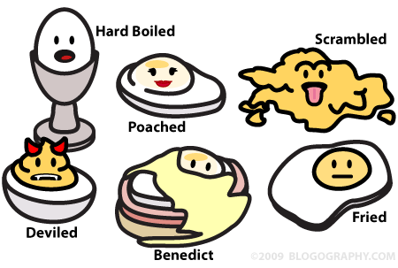

Views, Renderers, Resolvers, Oh, My!
==========

.fx: titleslide

---

Who am I?
====

.fx: image-right

Matthew Weier O'Phinney

* Project Lead, Zend Framework
* PHP Developer

----

Why a new View Layer?
----

* New MVC architecture == changes required
* Increase de-coupling
* Make serving alternate content types easier

----

Why a new View Layer?
----

.fx: image-right

* Zend_View was doing too much

Presenter Notes
----

* Resolved templates
* Managed helper and filter creation, registry, and invocation
* Variables container
* More!

---

A New Architecture
====

----

View Models
----

Presenter Notes
----

* Container for variables, template name, renderer options
* Create trees of view models, captured to variables
* Indicate a new root for the tree

----

Resolvers
----

Presenter Notes
----

* Resolve a template name to a resource the Renderer can consume

----

Renderers
----

Presenter Notes
----

* Accept a view model, and represent it
* Use the view model template, and Resolve it to a resource
* Optionally traverse trees of View Models
* Compose helpers as extension points

----

Helpers
----

Presenter Notes
----

* Extend the functionality of the renderer
    * Render URLs, snippets of markup, etc.

----

View
----

Presenter Notes
----

* Use strategies to choose which renderer to use
* Use strategies to determine how to populate the response
* Strategies are simply event listeners

----

Default MVC Integration
====

----

Goals
----

* Enable layouts by default
* Provide 404 pages by default
* Provide error pages by default
* Make providing action-specific views trivial
    * Provide sane defaults for view selection
* Provide basic rendering capabilities and response injection

----

Layouts
----

* `Zend\Mvc\Application` injects a `ViewModel` into the `MvcEvent`
* `Zend\Mvc\View\DefaultRenderingStrategy` has a configuration setting for the
  `layoutTemplate` name
* `Zend\Mvc\View\InjectViewModelListener` injects `ViewModel` results from
  controllers into the Layout ViewModel
* Layout controller plugin and view helper are available for accessing the
  layout `ViewModel`

----

404 Pages
----

* `Zend\Mvc\View\RouteNotFoundStrategy` handles 404s
* Invoked when routing fails
* Invoked when the matched controller does not exist
* Invoked when a controller sets a 404 response status
* Has a configuration setting for the `notFoundTemplate`, as well as whether or
  not to display the reason and/or exception messages.

----

Application Error Pages
----

* `Zend\Mvc\View\ExceptionStrategy` handles error pages
* Invoked when an exception is thrown by a controller
* Has a configuration setting for the `exceptionTemplate`, as well as whether or
  not to display exception messages

----

Action Views
----

* Controllers can return an associative array or null value
    * `Zend\Mvc\View\CreateViewModelStrategy`
* Controllers can return a `ViewModel` populated with variables only
    * `Zend\Mvc\View\InjectTemplateListener`
* Controllers can return a fully populated `ViewModel`
* Controllers can return a fully populated `Response`, which will bypass view
  rendering

Presenter Notes
----

* `CreateViewModelStrategy` creates `ViewModels` from empty arrays, null values,
  or assoc arrays
* `InjectTemplateListener` injects a template based on the active controller and
  optionally an action route parameter. It will be invoked in addition to above.

----

Rendering and Response Injection
----

* `Zend\Mvc\View\DefaultRenderingStrategy` registers
  `Zend\Mvc\Strategy\PhpRendererStrategy`, which:
    * Returns a `PhpRenderer` during the render phase
    * Injects the `Response` with the results of rendering
* Acts as the "render" event listener for the Application

----

Summary
----

* A lot of event listeners are setup to enable the most common use cases
  surrounding views.
* You can override almost any portion of it via either DI or extending
  `Zend\Mvc\Bootstrap` in order to override the `setupView()` method.

----

Common Tasks
====

Presenter Notes
----

* Now we get to the code

----

Configure Resolvers
----

* By default, an `AggregateResolver` is registered, with two child resolvers,
    * `TemplateMapResolver` maps template names to specific files
    * `TemplatePathStack` provides a stack of paths to consult, and a default
      file extension to use

----

Resolver Configuration
----

.fx: smaller-code

    !php
    <?php
    return array('di' => array('instance' => array(
      'Zend\View\Resolver\AggregateResolver' => array(
        'injections' => array(
          'Zend\View\Resolver\TemplateMapResolver',
          'Zend\View\Resolver\TemplatePathStack',
        ),
      ),
      'Zend\View\Resolver\TemplateMapResolver' => array(
        'parameters' => array(
          'map'  => array(
            'layout/layout' => __DIR__ . '/../view/layout/layout.phtml',
          ),
        ),
      ),
      'Zend\View\Resolver\TemplatePathStack' => array(
        'parameters' => array(
          'paths'  => array(
            'application' => __DIR__ . '/../view',
          ),
        ),
      ),
    )));

Presenter Notes
----

* Use the `TemplateMapResolver` for often-used view scripts, or ones you've got
  set in stone
* Use the `TemplatePathStack` for RAD purposes

----

Controllers: Provide data to the view
----

.fx: smaller-code

Explicitly:

    !php
    <?php
    use Zend\Mvc\Controller\ActionController;
    use Zend\View\Model\ViewModel;

    class HelloController extends ActionController
    {
        public function worldAction()
        {
            $model = new ViewModel(array(
                'message' => 'Hello, world!',
            ));
            $model->setTemplate('hello/world');
            return $model;
        }
    }

----

Controllers: Provide data to the view
----

.fx: smaller-code

Semi-Explicitly:

    !php
    <?php
    use Zend\Mvc\Controller\ActionController;
    use Zend\View\Model\ViewModel;

    class HelloController extends ActionController
    {
        public function worldAction()
        {
            return new ViewModel(array(
                'message' => 'Hello, world!',
            ));
        }
    }

Presenter Notes
----

* InjectTemplateListener will inject the template "hello/world" automatically
  based on the controller name and action.

----

Controllers: Provide data to the view
----

.fx: smaller-code

Implicitly:

    !php
    <?php
    use Zend\Mvc\Controller\ActionController;

    class HelloController extends ActionController
    {
        public function worldAction()
        {
            return array(
                'message' => 'Hello, world!',
            );
        }
    }

Presenter Notes
----

* CreateViewModelStrategy will create a view model with the returned array as
  the variables
* InjectTemplateListener will inject the template "hello/world" automatically
  based on the controller name and action.

----

Choose an alternate layout
----

.fx: smaller-code

Via configuration:

    !php
    <?php
    // in a config somewhere
    return array('di' => array('instance' => array(
        'Zend\Mvc\View\DefaultRenderingStrategy' => array(
            'parameters' => array(
                'layoutTemplate' => 'some/other/layout',
            ),
        ),
    )));

Presenter Notes
----

* This could be in your module, or your overrides under config/autoload/

----

Choose an alternate layout
----

.fx: smaller-code

From a controller:

    !php
    <?php
    use Zend\Mvc\Controller\ActionController;

    class HelloController extends ActionController
    {
        public function worldAction()
        {
            // ...

            $this->layout()->setTemplate('some/other/template');

            // ...
        }
    }

----

Choose an alternate layout
----

.fx: smaller-code

From a view script:

    !php
    <?php
    $this->layout()->setTemplate('some/other/template');

----

Choose an alternate layout
----

.fx: smaller-code

For an entire module:

    !php
    <?php
    namespace Custom;

    class Module {
        public function onRouteFinish($e) {
            $match      = $e->getRouteMatch();
            $controller = $match->getParam('controller');
            $segments   = explode('\\', $controller);
            $namespace  = array_shift($segments);
            if ($namespace != __NAMESPACE__) {
                return;
            }
            $e->getViewModel()->setTemplate('some/other/template');
        }
    }

Presenter Notes
----

* Basically, if we have a controller from our namespace, use an alternate layout
  template

----

Use multiple view models
----

.fx: smaller-code

Add a sidebar:

    !php
    <?php
    use Zend\Mvc\Controller\ActionController;
    use Zend\View\Model\ViewModel;

    class HelloController extends ActionController
    {
        public function worldAction()
        {
            $sidebar = new ViewModel($this->getMenuData());
            $this->layout()->addChild($sidebar, 'sidebar');

            return new ViewModel(array(
                'message' => 'Hello, world!',
            ));
        }
    }

Presenter Notes
----

* When rendering, both the "content" view model and the "sidebar" view model will
  be rendered and captured into the layout view model, prior to rendering the
  layout view model.

----

Use multiple view models
----

.fx: smaller-code

Add several models:

    !php
    <?php
    use Zend\Mvc\Controller\ActionController;
    use Zend\View\Model\ViewModel;

    class HelloController extends ActionController
    {
        public function worldAction()
        {
            $nav = new ViewModel($this->getNavData());
            $this->layout()->addChild($nav, 'nav');

            $sidebar = new ViewModel($this->getMenuData());
            $this->layout()->addChild($sidebar, 'sidebar');

            $footer = new ViewModel($this->getFooterData());
            $this->layout()->addChild($footer, 'footer');

            return new ViewModel(array(
                'message' => 'Hello, world!',
            ));
        }
    }

----

Render without a layout
----

.fx: smaller-code

Mark the ViewModel as "terminal":

    !php
    <?php
    use Zend\Mvc\Controller\ActionController;
    use Zend\View\Model\ViewModel;

    class HelloController extends ActionController
    {
        public function worldAction()
        {
            $model = new ViewModel(array(
                'message' => 'Hello, world!',
            ));
            $model->setTerminal(true);
            return $model;
        }
    }

Presenter Notes
----

* "terminal" model is now considered the new "root" from which to begin
  rendering; the layout will be skipped.

----

Don't render a view
----

.fx: smaller-code

Simply return a Response at any time:

    !php
    <?php
    use Zend\Mvc\Controller\ActionController;

    class HelloController extends ActionController
    {
        public function worldAction()
        {
            // Optionally, give a status code, or populate it
            return $this->getResponse();
        }
    }

----

Handling Alternate Content Types
====

----

An egg is not always an egg
----

Presenter Notes
----

* Some like scrambled, some like poached, etc.
* Same with requests -- sometimes we want HTML, sometimes JSON, sometimes feeds

----

Serving JSON
----

Enter the `JsonStrategy`

* If a `JsonModel` is returned, use the `JsonRenderer`
* If the Accept header prefers `application/json`, use the `JsonRenderer`
* Disables the layout, and renders a nested JSON object based on the model and
  its children

----

Serving JSON
----

.fx: smaller-code

    !php
    <?php
    use Zend\View\Strategy\JsonStrategy;

    // In a Module class...
    public function onRouteFinish($e) {
        // ... match namespace ...
        $app     = $e->getTarget();
        $locator = $app->getLocator();
        $view    = $locator->get('Zend\View\View');
        $json    = $locator->get('Zend\View\Strategy\JsonStrategy');
        $view->attach($json, 100);
    }

Presenter Notes
----

* High priority means it will match before the PhpRenderer, but fall through to
  the PhpRenderer if unable to match

----

Serving Feeds
----

Enter the `FeedStrategy`

* If a `FeedModel` is returned, use the `FeedRenderer`
* If the Accept header prefers `application/atom+xml` or `application/rss+xml`,
  use the `FeedRenderer`
* Disables the layout, and renders a Feed, based on the contents of the
  `ViewModel` or `FeedModel` provided

Presenter Notes
----

* The FeedModel can either compose a `Zend\Feed\Writer\Feed` object, or build
  one using `Zend\Feed\Writer\FeedFactory` based on the variables assigned.
* Enabling it is exactly the same as for the `JsonStrategy`

----

Combined Strategies
----

* You should be paying attention to Accept priority
* Having a single rendering strategy is faster and easier to test

----

Combined Strategies Example
----

.fx: smaller-code

    !php
    <?php
    class CustomStrategy implements ListenerAggregate {
        public function onRender($e) {
            $request = $e->getRequest();
            $headers = $request->headers();
            if (!$headers->has('accept')) {
                return $this->phpRenderer;
            }
            $accept = $headers->get('accept');
            foreach ($accept->getPrioritized() as $mediaType) {
                if (0 === strpos($mediaType, 'application/json')) {
                    return $this->jsonRenderer;
                }
                if (0 === strpos($mediaType, 'application/rss+xml')) {
                    $this->feedRenderer->setFeedType('rss');
                    return $this->feedRenderer;
                }
                if (0 === strpos($mediaType, 'application/atom+xml')) {
                    $this->feedRenderer->setFeedType('atom');
                    return $this->feedRenderer;
                }
            }
            return $this->phpRenderer;
        }
    }

Presenter Notes
----

* This just shows the renderer selection
* strpos is used to allow vendor extensions to content types
* Full example, including response selection, is in the manual

----

Things the View Layer Does Not Do (Yet)
====

----

Helper injection
----

.fx: smaller-code

This sort of thing is still necessary:

    !php
    <?php
    public function onBootsrap($e)
    {
         $app      = $e->getParam('application');
         $basePath = $app->getRequest()->getBasePath();
         $locator  = $app->getLocator();
         $renderer = $locator->get('Zend\View\Renderer\PhpRenderer');
         $router   = $locator->get('Zend\Mvc\Router\RouteStack');
         $renderer->plugin('basePath')->setBasePath($basePath);
         $renderer->plugin('doctype')->setDoctype('HTML5');
         $renderer->plugin('url')->setRouter($router);
    }

----

Layout variable hinting
----

.fx: smaller-code

Seed the layout with some configuration:

    !php
    <?php
    public function onBootsrap($e)
    {
        $app      = $e->getParam('application');
        // ...
        $config    = $e->getParam('config');
        $viewModel = $application->getMvcEvent()->getViewModel();
        $viewModel->config = $config->layout;
    }

Presenter Notes
---

* Allows creating a top-level assoc array under the "layout" key with
  layout-specific variables, or variables you want to use everywhere
* Thanks to Rob Allen for the idea!

----

Wrapping Up
====

----

What we covered
----

* Assemble ingredients (view models)
* Provide recipes (resolvers)
* Prepare the recipe from the ingredients (renderers)
    * Have some prep cooks around to assist (helpers)
* Have a top-notch waiter to take orders and provide a nice presentation (view)

---

Resources
----

* This presentation:
    * http://mwop.net/slides/2012-04-25-ViewWebinar/Zf2Views.html
* Zend\\View quick start:
    * http://bit.ly/I4cfjs

---

Thank You!
====

* Feedback?
    * http://framework.zend.com/zf2
    * http://twitter.com/weierophinney
