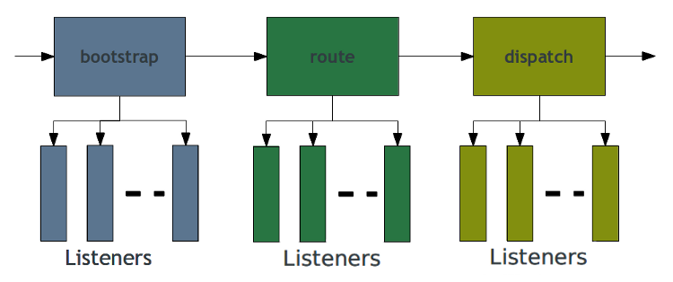

Creating Re-usable Modules for Zend Framework 2
==========

.fx: titleslide

----

Who am I?
====

.fx: image-right

Matthew Weier O'Phinney

* Project Lead, Zend Framework
* PHP Developer
* http://mwop.net/
* @weierophinney

----

Goals
====

* Learn the basics of ZF2
* Learn what modules are, and how to use them
* Build a module

Presenter Notes
----

* In the process, we'll learn about a bunch of ZF2 functionality

----

MVC Quick Start
====

----

Three core concepts
----

* Decoupled and DI-driven (`ServiceManager`, `Di`)
* Event-driven (`EventManager`)
* HTTP handlers (`DispatchableInterface`)

----

Decoupling, DI, and Services
====

----

The problem
----

> How do controllers get their dependencies?

Presenter Notes
----

* Core problem in ZF1 is there is no clean way to do this

----

Decoupling
----

* **Contract Oriented Design**
* Favor composition over inheritance
    * ... and thus _dependency injection_

Presenter Notes
----

* Zend\\Di is robust and well-tested
* But we won't talk about it. We're focussing on the SM now

----

Service Manager
====

----

Zend\\ServiceManager
----

* Very fast -- no magic or discovery
* Code -- don't configure -- your injections
* Explicit wiring -- it's all code -- makes debugging easy

----

Types of services
----

* Explicit (name => object pairs)
* Invokables (name => class to instantiate)
* Factories (name => callable returning object)
* Aliases (name => some other name)
* Abstract Factories (unknown services)
* Scoped Containers (limit what can be created)
* Shared (or not; you decide)

----

Example: service
----

.fx: smaller-code

    !php
    <?php
    array('services' => array(
        'foo' => new Some\Component\Foo(),
    ))

----

Example: invokable
----

.fx: smaller-code

    !php
    <?php
    array('invokables' => array(
        'foo' => 'Some\Component\Foo',
    ))

----

Example: factories
----

.fx: smaller-code

    !php
    <?php
    array('factories' => array(
        'foo' => function ($services) {
            // lazy-loading, essentially:
            return new Some\Component\Foo();
        },
        'bar' => 'Some\Static::method',
        'baz' => 'Some\Class\Implementing\FactoryInterface',
    ))

Presenter Notes
----

* Basically, any PHP callable can be used
* Or implement the FactoryInterface, which makes things more explicit

----

Example: aliases
----

.fx: smaller-code

    !php
    <?php
    array('aliases' => array(
        'my_foo' => 'foo',        // alias services
        'foo_master' => 'my_foo', // alias aliases
    ))

----

Example: abstract factories
----

.fx: smaller-code

    !php
    <?php
    array('abstract_factories' => array(
        'Class\Implementing\AbstractFactoryInterface',
    ))

    class SampleAbstractFactory implements AbstractFactoryInterface
    {
        public function canCreateServiceWithName($name) {/* */}
        public function createServiceWithName(
            ServiceLocatorInterface $locator, $name
        ) { /* */ }
    }

Presenter Notes
----

* Makes it relatively easy to create a "catch-all" factory to provide instances
* Good as a factory for context-specific types

----

Example: (un)shared service
----

.fx: smaller-code

    !php
    <?php
    array('shared' => array(
        'EventManager' => false, // default is true
    ))

----

Configure services anywhere
----

* Application configuration
* Module classes
* Module configuration
* Local override configuration

----

Why?
----

* MVC uses the `ServiceManager` to wire the default workflow and event listeners
* Developers provide additional services and service configuration

Presenter Notes
----

* **controllers** are services!

----

Event Manager
====

----

Zend\\EventManager in a slide
----

* **Trigger** _events_
* **Listen** and react to triggered _events_

----

Terminology
----

.fx: image-right

* An **Event Manager** is an object that aggregates listeners for one or more
  named events, and which triggers events.
* A **Listener** is a callback that can react to an event.
* An **Event** is an action.

----

Example
----

.fx: smaller-code

    !php
    <?php
    use Zend\EventManager\EventManager;
    $events = new EventManager();
    $events->attach('do', function ($e) {
        printf(
            'Handled event "%s" with parameters "%s"'
            $e->getName(),
            json_encode($e->getParams())
        );
    });
    $params = array('foo' => 'bar', 'baz' => 'bat');
    $events->trigger('do', null, $params);

----

Everything is an event
----

----

MVC Events
----

* Loading modules: **loadModules.pre**, **loadModule**, **loadModules.post**
* **bootstrap**
* **route**
* **dispatch** and **dispatch.error**
* **render**
* **finish**

----

Dispatchables == Controllers
====

----

What is a web application?
====

----

HTTP negotiation.
====

----

DispatchableInterface
----

    !php
    <?php
    namespace Zend\Stdlib;

    interface DispatchableInterface
    {
        public function dispatch(
            RequestInterface $request,
            ResponseInterface $response = null
        );
    }

Presenter Notes
----

* Implication is that you return a response
* Because we pass one in, can return arbitrary results

----

Shipped contollers
----

* Zend\\Mvc\Controller\\ActionController
* Zend\\Mvc\Controller\\RestfulController

Presenter Notes
----

* Compose an EM; dispatch actually simply triggers an event
* Compose the SM; you _can_ lazily retrieve dependencies, but it's mostly there
  to assist with a variety of plugins
* Compose a PluginBroker, Event, and more

----

Most importantly...
----

> Controllers are _services_

Presenter Notes
----

* This allows them to be injected by the SM or DIC
* It means we're mainly interested in configuring the SM and EM

----

Configuring the MVC
====

Presenter Notes
----

* We've talked about the core concepts
* How do we wire it together?

----

Things that must happen
----

* Configure services
* Wire event listeners

----

Core services
----

* Router
* View
* *Controllers*

----

How do we provide configuration?
====

----

Modules
====

----

What?
----

> A **module** is all related code and assets that _solve a specific problem_. 

Presenter Notes
----

* Don't put unrelated code in the same module
* Assets related to the code _should_ be in the module

----

Modules in ZF2
----

* Modules provide the MVC with configuration:
    * Autoloading
    * Routing
    * Controllers
* Modules provide and attach listeners

----

How?
----

* **Zend\\ModuleManager** loops through modules, and passes `Module` objects to
  listeners.
* Listeners look for _features_ modules provide.

----

Common Module Features
----

* Autoloading configuration
* Service configuration
* General configuration
* Bootstrap listeners

Presenter Notes
----

* Each "feature" has an accompanying interface
* Listeners look for either interface implementation OR duck-typing

----

Module classes
----

* A namespace...
* ...containing a single classfile, **Module.php**... 
* ...containing a single class, `Module`.

----

> When you write ZF2 MVC applications, you will write Modules.

----

Skeleton Application
====

Presenter Notes
----

* The ZF2 community built this to make the job of starting simpler
* Provide basic application structure and configuration

----

Getting it
----

.fx: smaller-code

    !sh
    cd my/project/dir
    git clone \
        git://github.com/zendframework/ZendSkeletonApplication.git
    cd ZendSkeletonApplication
    php composer.phar install

----

Let's look through it
----

 (Live coding here...)

----

Module Demonstration
====

----

PhlyContact
----

* Simple, configurable contact form functionality
    * Configure a mail transport
    * Configure the captcha used in the form
    * Potentially configure and change the route

----

Install
----

Via composer:

* Edit composer.json to add a new requirement
* `php composer.phar install`

Presenter Notes
----

* Alternately, the attendees can drop the "PhlyContact" file into the vendor
  subdir

----

Configure
----

* Copy the module's "config/module.phly-contact.local.php" to the application's
  "config\autoload\" directory, and edit
* Edit "config/application.config.ini" to add the module

Presenter Notes
----

* Live coding time

----

Try it out!
----

---

Other things we could do
----

* Alter the base route
* Alter the captcha
* Change what controller ultimately wasy called
* Change where view scripts resolve

Presenter Notes
----

* Local configuration allows overriding in a variety of ways

----

Break time!
====

---------------------------------------------------------------

Project Walkthrough
====

----

PhlyPeep: Dead Simple Twitter Clone
----

    "peep": Make a cheeping or beeping sound

* Show a timeline of all "peeps"
* Show a timeline of individual user's "peeps"
* Show individual "peeps"
* Allow authenticated users to "peep"

----

Demo time
====

----

Dependencies
----

* We don't want to write authentication ourselves
    * We'll install the "ZfcUser" module to save some work

----

Installing ZfcUser
----

(live coding)

----

Create the module
====

----

simple steps:
----

* Create a directory, "vendor/PhlyPeep"
* Create a "Module" class in "vendor/PhlyPeep/Module.php"
* Create "config", "data", "src/PhlyPeep", and "view" subdirectories

----

Module.php
----

.fx: smaller-code

    !php
    <?php
    namespace PhlyPeep;

    class Module {
        public function getAutoloaderConfig() {
            return array(
                'Zend\Loader\StandardAutoloader' => array(
                    'namespaces' => array(
                        'PhlyPeep' => __DIR__ . '/src/PhlyPeep',
                    )
                )
            );
        }

        public function getConfig() {
            return include __DIR__ . '/config/module.config.php';
        }
    }

----

First things first: Modelling
====

----

Model the peep and create a schema
----

* identifier (hash of username + timestamp + tweet text)
* username
* user_email (for gravatar)
* user_fullname (?)
* timestamp
* peep_text

----

Entity
----

.fx: smaller-code

    !php
    <?php
    namespace PhlyPeep\Model;
    
    use Zend\InputFilter\InputFilterAwareInterface;
    use Zend\InputFilter\InputFilterInterface;
    use Zend\Stdlib\ArraySerializableInterface;
    
    class PeepEntity implements 
        ArraySerializableInterface,
        InputFilterAwareInterface
    {
        protected $filter;
    
        protected $identifier;
        protected $username;
        protected $email;
        protected $displayName;
        protected $timestamp;
        protected $peepText;
    }

----

Schema
----

.fx: smaller-code

    !sql
    CREATE TABLE peep
    (
        identifier    CHARACTER(8) PRIMARY KEY NOT NULL,
        username      VARCHAR(255) NOT NULL,
        email         VARCHAR(255) NOT NULL,
        display_name  VARCHAR(50) DEFAULT NULL,
        timestamp     INTEGER NOT NULL,
        peep_text     TEXT NOT NULL
    );

    CREATE INDEX peep_username ON peep(username);

----

Validation
====

----

Validate and normalize
----

* Identifiers should be 8 characters
* Username should ...
* Email should be valid
* Timestamp should be an integer
* We need at least _some_ text

----

Zend\\InputFilter
----

* Define "inputs", which know how to normalize and validate themselves, and
  define "meta-behavior" (required, allow empty, etc.).
* Define "input filters", which aggregate inputs and other input filters, and
  are capable of validating the entire or partial sets.
* Perfect fit for _models_
* Perfect fit for _forms_

----

Persistence
====

----

Zend\\Db
----

* Robust and flexible database abstraction layer (DBAL)
* Offers query abstraction
* Offers Table and Row Data Gateway implementations

----

Service Layer (and Pagination)
====

----

Service Layer?
----

* Abstract domain model operations from persistence operations
* We'll use it to return paginators instead of result sets
* We'll use it to provide the minimum useful interface to the domain

----

Zend\\Paginator
----

* Paginate arbitrary data sets
* Adapters need only implement `getItems($offset, $numPerPage)` and `count()`

----

Form
====

----

Zend\\Form
----

* Bridges the domain model and view
* Elements, fieldsets, and forms
    * Each defines a *name* and *attributes*
    * Fieldsets aggregate elements and fieldsets
    * Forms aggregate input filters and can bind to objects

----

Routes and Controller
====

----

config/module.config.php
----

(live coding time)

----

PeepController.php
----

(live coding time)

----

View scripts and helpers
====

----

What we need
----

View Scripts:

* "index" -- show the public timeline
* "form-error" -- display peep submission errors
* "username" -- display user timelines
* "401" -- unauthorized (peeping without authorization)

----

What we need
----

View Helpers

* "PeepText" -- escape a peep, but also link any URLs
* "PeepForm" -- show a form if user authorized, link to login/register otherwise

----

Service Factories
====

----

What we need
----

* Controller factory
    * inject authentication service
    * inject peep service
* Peep service factory
    * inject peep table object
* Peep table factory
    * inject database adapter
    * inject configuration

---

Configuration
====

----

What we need to configure
----

* services
* routes (already done)
* controllers
* view information

----

Define Dependencies
====

----

composer.json
----

.fx: smaller-code

    !javascript
    {
        "name": "phly/phly-peep",
        "description": "Rudimentary twitter clone",
        "type": "library",
        "keywords": ["zf2", "zend", "module"],
        "homepage": "https://github.com/weierophinney/PhlyPeep",
        "authors": [ /* ... */ ],
        "require": {
            "php": ">=5.3.3",
            "zendframework/zendframework": "dev-master",
            "zf-commons/zfc-user": "dev-master"
        },
        "autoload": {
            "psr-0": {
                "PhlyPeep": "src/"
            },
            "classmap": [
                "./"
            ]
        }
    }

----

Add it to your Application
====

----

config/application.config.php
----

.fx: smaller-code

    !php
    <?php
    return array(
        'modules' => array(
            'Application',
            'PhlyContact',
            'PhlyPeep',    // HERE IT IS!
            'ZfcBase',
            'ZfcUser',
        ),
        /* ... */
    );

----

Time to test!
====

----

Bonus tasks
----

* Add caching to the timelines
* Add search capabilities
* Allow using a queue/job service to insert peeps
    * Offload caching, search index updating
* Add Atom/RSS feeds
* Allow peep retrieval via XMLHttpRequest

----

Takeaways
====

----

Module naming
----

Prefix modules with your vendor name

* PhlyBlog, ZfcUser, OcraComposer, etc.

----

Use service aliases
----

.fx: smaller-code

Define _aliases_, _routes_, etc. using a normalized module prefix; point them to
_class names_ or _interfaces_ by default. (`phly-peep-service`,
`zfcuser_db_adapter`, etc.)

    !php
    <?php
    return array(
        'service_manager' => array('aliases' => array(
            'phly-peep-db-adapter' => 'Zend\Db\Adapter\Adapter',
        ))
    );

----

Enable helpers via the service manager
----

.fx: smaller-code

Helpers and plugins can be looked up via the service manager. Leverage that.

    !php
    <?php
    return array(
        'service_manager' => array(
            'invokables' => array(
                'peeptext' => 'PhlyPeep\View\PeepText',
            ),
            'factories' => array(
                'peepform' => 'PhlyPeep\Service\PeepViewFormFactory',
            ),
        )
    );

----

Routing
----

.fx: smaller-code

Define a single, top-level route for the module, with children beneath

    !php
    <?php
    return array('router' => array('routes' => array(
        'phly-peep' => array(
            'type' => 'Literal',
            /* ... */
            'may_terminate' => true, // or not
            'child_routes' => array(
                /* all other routes for this module */
            ), 
        )
    )));

----

Be explicit about dependencies
----

Define and delineate dependencies, preferably via a form of package metadata.

* Make it easy to install your module; developers _like_ easy
* Document installation and post-install steps
* Look for existing modules when possible, and extend from them or use their
  functionality
* Composer and Pyrus are *awesome*!

----

Thank You!
====

* Feedback?
    * https://joind.in/6221
    * http://framework.zend.com/zf2
    * http://twitter.com/weierophinney
