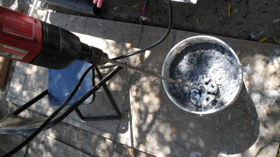

# Beautiful Software

Matthew Weier O'Phinney

ZendCon 2012

.fx: titleslide

---

# Who is that guy?

* Matthew Weier O'Phinney
* Project Lead, Zend Framework
* [https://github.com/weierophinney](https://github.com/weierophinney)
* [http://mwop.net/](http://mwop.net/)
* @weierophinney

---

# Analogies

# Presenter Notes

- Haven't always been a developer; worked in construction and design both at
  different times.
- Both provide lessons for us to learn from.

---

# Construction

.fx: imageslideheadingbottom whiteheading

# Presenter Notes

- Construction has a few basic tools and methods.

---

# 

.fx: imageslide

# Presenter Notes

- Hammers are the raw materials for assembly.

---

# 

.fx: imageslide

# Presenter Notes

- Saws allow us to make materials fit.

---

# 

.fx: imageslide

# Presenter Notes

- Drills are used to make roads for pipes and wires, and to attach things to the
  building's frame.
- Carpenters can do a lot with these tools, without investing much time in
  mastering them. But then you end up with houses like this:

----

# 

.fx: imageslide

# Presenter Notes

- Dull, unimaginative, and likely full of flaws both big and small that will
  drive you crazy over time.

---

# 

.fx: imageslide

# Presenter Notes

- Things like bathrooms that crowd you in so much, you can't move.

---

# 

.fx: imageslide

# Presenter Notes

- or kitchens so poorly laid out that you have nowhere to do the essential work
  of cooking.
- A good carpenter takes the time to learn his trade.

---

# 

.fx: imageslide

# Presenter Notes

- She uses a finishing hammer instead of a framing hammer in order to do fine
  detail that doesn't leave marks.

---

# 

.fx: imageslide

# Presenter Notes

- A drywall hanger, knowing he has to get the stone up quickly, uses an impact
  driver so he can screw it into the frame quickly.

---

# 

.fx: imageslide

# Presenter Notes

- A finisher will have a mud mixer so he can get the joint compound to the right
  consistency.

---

# 

.fx: imageslide

# Presenter Notes

- Manchester Cathedral
- Basically, a craftsman aims to build things that last.

---

# 

.fx: imageslide

# Presenter Notes

- I also worked as a graphics technician

---

# 

.fx: imageslide

# Presenter Notes

- I drew maps used in guidebooks

---

# 

.fx: imageslide

# Presenter Notes

- and did catalog and book layout.
- I didn't design them, though. That was the job of the designer.

---

# 

.fx: imageslide

# Presenter Notes

- A designer considers things like typography -- what font communicates best for
  the content, how the space between letters, words, and paragraphs will convey
  a message.

---

# 

.fx: imageslide

# Presenter Notes

- Color and gradients are chosen to help lead the eye around the page, guiding a
  viewer to the message.

---

# 

.fx: imageslide

# Presenter Notes

- Essentially, a good designer is thinking about how things relate semantically.
- "Kate Ray interviews leading lights in the semantic web: see video at vimeo.
  Wordle made by Jim Stauffer."

---

# 

.fx: imageslide

# Presenter Notes

- You *could* build something or design something out of duct tape -- but would
  it have lasting value?
- Yes, it might last, it's duct tape, after all.

---

# PHP

# Presenter Notes

- But what does this have to do with PHP?
- When I started programming again, I started with Perl, classic ASP, and Perl.
  They all excelled at letting you get immediate results.

---

# 

.fx: imageslide

# Presenter Notes

- Ball of nails analogy
- PHP gives you all the tools you need to get things done...

---

# 

.fx: imageslide

# Presenter Notes

- If you need to connect to a database, you can. If you need to process a form,
  PHP was built for that.
- Over time, I added more tools to my belt...

---

# &lt;?xml

# Presenter Notes

- OOP, DOM manipulation, and more.
- These made me more efficient, but not necessarily *better*.
- My point: do you want to crank out code, or *craft code*?

---

# Beautiful Software: Software Craftmanship

# Presenter Notes

- Just like a carpenter or a designer, you consider the small details, and how
  they relate to the whole.
- How do objects relate, how do the communicate with each other, how do you
  subsitute implementations, and more.

---

# Responsibilities

* Maintainability
* Extensibility
* Substitution

# Presenter Notes

- How easy is it to fix an issue, or add a feature?
- Can the behavior be extended or modified?
- Can you create alternate implementations easily?

---

# Principles

**Don't Repeat Yourself** (DRY), and avoid **Not Invented Here** (NIH) syndrome.

---

# Principles

**You Ain't Gonna Need It** (YAGNI)

---

# Principles

Favor **Composition** over inheritance

- Use value objects
- Move shared logic into traits or helpers

# Presenter Notes

- Essentially, the "Open Closed Principle"

---

# Principles

Create **Contracts** for your objects

- Define interfaces

# Presenter Notes

* Interface Segregation Principle, and related to Liskov Substitution Principle
  and the Dependency Inversion principle.

---

# Principles

Objects should **do one thing**, well.

- Methods should also be short
- Use Facades to simplify and organize

# Presenter Notes

- Single Responsibility Principle

---

# Practical Example

---

# Pastebin

# Presenter Notes

- Pastebins are for sharing code.

---

# Pastebin

# Presenter Notes

- They can be listed, unless private

---

# Pastebin

# Presenter Notes

- Each paste may be viewed via unique hash URL

---

# Novice approach

    !php
    $hash = $_GET['hash'];
    mysql_connect();
    $res = mysql_query(
        "SELECT * FROM pastes WHERE hash = '$hash'"
    );
    $row = mysql_fetch_assoc($res);

# Presenter Notes

- Is it good?
  - security issues
  - untestable
  - cannot alter behavior without altering code

---

# A Manageable Approach

# Presenter Notes

- We'll look at decisions and details I'd consider when developing this
  functionality.

---

# Test all the things

# Presenter Notes

- Let's you play with the system before committing to it
- Experiment with object interactions
- Don't like something? fix it.

---

# Pastebin Requirements

- We need to be able to create new "pastes".
- We need to be able to view a given "paste".
- We need to be able to list non-private "pastes", in reverse order from when
  they were created.

# Presenter Notes

* Lead in to next slide: First things first, create a value object representing
  a paste.

---

# Value object / Entity

Why?

- Arrays are not typed
- Arrays require testing key existence
- Arrays require manual reference handling

---

# Why arrays suck

    !php
    echo (array_key_exists('content', $this->paste) 
        ? $this->paste['content'] 
        : '');
    echo (array_key_exists('language', $this->paste) 
        ? $this->paste['language'] 
        : '');

# Presenter Notes

* Consider it from a view script: messy.
* Unless you're willing to clog up your error logs.
* These are important details.

---

# Why value objects work

    !php
    echo $this->paste->content;
    echo $this->paste->language;

# Presenter Notes

* We know what's available based on type
* Our code becomes simpler

---

# Paste

    !php
    class Paste
    {
        public $hash;
        public $language = 'txt'; // programming language of content
        public $content = '';
        public $timestamp;
        public $private = false;
    }

# Presenter Notes

- Now we know what properties and/or methods are available
- Now that we have our object, let's start considering behavior. We need to
  think about identity of each paste.

---

# Identity

    !php
    public function testCreateReturnsAHashIdentifier()
    {
        $paste = new Paste();
        $this->service->create($paste);
        $this->assertRegex(
            '/^[a-f0-9]{8}$/', $paste->hash
        );
    }

# Presenter Notes

- I've made decisions about architecture:
  - A service layer will encapsulate business logic
  - I've specified what a hash looks like (16^8, or > 4 billion, possible
    identities
- Now let's look at fetching pastes

---

# Fetch a paste

    !php
    public function testCanFetchAPasteByHash()
    {
        $paste = new Paste();
        $this->service->create($paste);
        $test = $this->service->fetch($paste->hash);
        $this->assertInstanceOf('Paste', $test);
        $this->assertEquals($paste, $test);
    }

# Presenter Notes

- Compare that two objects are equal -- but not necessarily identical.

---

# Fetch a list of pastes

    !php
    public function testCanFetchCollectionOfPastes()
    {
        // seed the service first
        $count = $this->seedService($this->service); 
        $collection = $this->service->fetchAll();
        $this->assertInstanceOf(
            'Zend\Paginator\Paginator');
        $this->assertEquals($count, count($collection));
    }

# Presenter Notes

- List in reverse chronological order
- TDD often criticized for being rushed and not resulting in design or
  architecture. Rubbish. We make design decisions.
- Choosing to return Paginator; who wants to pull 4 billion results?

---

# Iterate

    !php
    public function testPastesAreInReverseChronoOrder()
    {
        // seed the service first
        $this->seedService($this->service); 
        $collection = $this->service->fetchAll();
        $previous   = false;
        foreach ($collection as $paste) {
            $this->assertInstanceOf('Paste', $paste);
            if ($previous) {
                $this->assertLessThan($previous, 
                    $paste->timestamp);
            }
            $previous = $paste->timestamp;
        }
    }

# Presenter Notes

- Testing that as we iterate, we get Paste objects, and that each is older than
  the previous
  - Another design decision: using timestamps, which allows for comparison.

---

# Public only

    !php
    public function testCollectionContainsNoPrivates()
    {
        // seed the service first
        $this->seedService($this->service); 
        $collection = $this->service->fetchAll();
        foreach ($collection as $paste) {
            $this->assertInstanceOf('Paste', $paste);
            $this->assertFalse($paste->private);
        }
    }

# Presenter Notes

- Assert both type, and value of property

---

# What about the code?

# Presenter Notes

- I've showed tests, and the Paste object only. What about the service?
- Notice that I've not shown anything about how pastes are persisted.
- Jr. dev would start with schema. But what if RDBMS is the wrong tool for the
  job? What if I want to cache?

---

# Service interface

    !php
    interface PasteServiceInterface {
        /**
         * @return Paste
         */
        public function create(Paste $paste);
        /**
         * @return Paste|null
         */
        public function fetch($hash);
        /**
         * @return \Zend\Paginator\Paginator
         */
        public function fetchAll();
        /**
         * @return bool
         */
        public function exists($hash);
    }

# Presenter Notes

- PHP doesn't allow defining return values; thus annotations
- What is the "exists" method for? We'll cover that later.

---

# Implementation

    !php
    class MemoryPasteService implements 
        PasteServiceInterface
    {
        protected $pastes = array();
        protected $public;
        public function create(Paste $paste)
        {
            $hash = $this->createHash($paste);
            $paste->hash = $hash;
            $this->pastes[$hash] = $paste;
            if (!$this->pastes->private) {
                $this->public->insert($paste);
            }
            return $paste;
        }
    }

# Presenter Notes

- Simple implementation, in-memory
- What is "createHash()"?

---

# Create a hash

    !php
    trait CreateHash {
        public function createHash(Paste $paste) {
            $hashSeed = sprintf(
                '%d:%s:%s', 
                microtime(true), 
                $paste->language,
                hash('sha1', $paste->content)
            );
            do {
                $hashSeed .= ':' . uniqid();
                $hash      = hash('sha256', $hashSeed);
                $hash      = substr($hash, 0, 8);
            } while ($this->exists($hash));
            return $hash;
        }
        abstract public function exists($hash);
    }

# Presenter Notes

- We need to create a unique hash. Collisions force generation of a new one
- exists() method allows us implementations to define it themselves.
  - Defined in both interface and trait == must implement!!!
- "But we don't have 5.4 on our servers yet!"

---

# Create a hash, redux

    !php
    abstract class CreateHash
    {
        public static function createHash(
            Paste $paste, 
            PasteServiceInterface $service
        ) {
            // all is the same except that the "while" 
            // condition becomes:
            //     while ($service->exists($hash))
        }
    }

# Presenter Notes

- This will work in any version.
- Abstract means we cannot instantiate.
- Important thing to consider is that this doesn't require inheritance, but
  rather sending messages between objects.

---

# Existence

    !php
    class MemoryPasteService implements 
        PasteServiceInterface
    {
        use CreateHash;

        /* ... previous code ... */

        public function exists($hash)
        {
            return array_key_exists($hash, 
                $this->pastes);
        }
    }

# Presenter Notes

- Using traits, because I can
- Very simple test.

---

# Fetch a paste

    !php
    class MemoryPasteService implements 
        PasteServiceInterface
    {
        /* ... previous code ... */
        public function fetch($hash)
        {
            if (!$this->exists($hash)) {
                return null;
            }
            return $this->pastes[$hash];
        }
    }

# Presenter Notes

- How you handle errors is up to you
  - Do you consider inability to fetch recoverable?

---

# Fetch many

    !php
    class MemoryPasteService implements 
        PasteServiceInterface
    {
        /* ... previous code ... */
    
        public function fetchAll()
        {
            $adapter   = new IteratorPaginator(
                $this->public);
            $paginator = new Paginator($adapter);
            return $paginator;
        }
    }

# Presenter Notes

- Our tests said we needed to return a paginator
- Only fetch public pastes
  - but what is the "public" property?

---

# Filtering

    !php
    class SortedPastes extends SplMaxHeap {
        public function insert($value) {
            if (!$value instanceof Paste) {
                throw new \InvalidArgumentException();
            }
            parent::insert($value);
        }
        public function compare($a, $b) {
            if ($a->timestamp === $b->timestamp) {
                return 0;
            }
            if ($a->timestamp > $b->timestamp) {
                return 1;
            }
            return -1;
        }
    }

# Presenter Notes

- Know your tools, especially the SPL
- Max heap sorts larger values to the top. 
- Our public property will be a heap

---

# Internal implementations

    !php
    class MemoryPasteService implements 
        PasteServiceInterface
    {
        /* ... previous code ... */
    
        public function __construct()
        {
            $this->public = new SortedPastes;
        }
    }

# Presenter Notes

- Internal implementation details may not need composition
- Tests now pass!

---

# Isn't it overkill?

# Presenter Notes

- Aren't we making a simple idea complex?
- Do we really want to store in memory?
- The point: we've made something replaceable
  - The trait encapsulates shared logic
  - The interface defines the expected operations

---

# Alterate implementation

    !php
    class MongoPasteService implements 
        PasteServiceInterface {
        use CreateHash;
        protected $collection;
        public function __construct(
            MongoCollection $collection
        ) {
            $this->collection = $collection;
        }
        public function create(Paste $paste)
        {
            $hash = $this->createHash($paste);
            $paste->hash = $hash;
            $data = (array) $paste;
            $this->collection->insert($data);
            return $paste;
        }
    }

# Presenter Notes

- Requires some work to get cursors to return Paste objects
- But the point is that I consume it exactly the same

---

# Decorator

    !php
    class CachingService implements 
        PasteServiceInterface
    {
        protected $cache;
        protected $service;
        public function __construct(
            Cache $cache, PasteServiceInterface $service
        ) {
            $this->cache = $cache;
            $this->service = $service;
        }
        public function create(Paste $paste)
        {
            $paste = $this->service->create($paste);
            $this->cache->store($paste->hash, $paste);
            $this->cache->invalidate('list');
        }
    }

# Presenter Notes

- No inheritance -- compose, and implement the interface.
  - Allows us to write code once, and consume any implementation
- Knowledge of _design patterns_, coupled with good composition, allows us to
  accomplish non-trivial patterns simply.

---

# 

# Presenter Notes

- Interactions are clearly defined
- Substitution is easily possible
- Changing _implementation_ details does not affect the consumer

---

# Summary

The goals of software craftsmanship are:

- Maintainability.  
- Extensibility.
- Substitution.

---

# Tools

- **Don't Repeat Yourself** (DRY), and avoid **Not Invented Here** (NIH) syndrome.
- **You Ain't Gonna Need It** (YAGNI) principle.
- Favor **composition** over inheritance.
- Create **contracts** for your objects.
- Have objects (and methods!) **do one thing**, and one thing well.

# Presenter Notes

- Making these goals and principles your focus allows you to achieve beauty in
  software

---

# Practice Software Craftsmanship

---

# Thank You
