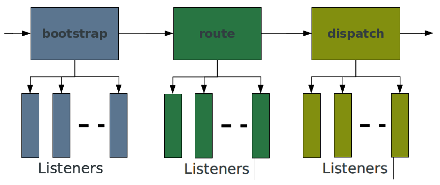

# Zend Framework 2

Matthew Weier O'Phinney

AFUP PHP Tour

Nantes, France

November 2012

.fx: titleslide

---

# Core Concepts

- Events (workflow)
- Services (what passes through the workflow)
- Modules (wiring services to the workflow)

---

# EventManager

---

# Events

- An object *triggers* an *event*
- Other objects *listen* to *events*

---

# Terminology

- An **Event** is both an *action* and a *value object*.
- A **Listener** is a callback that accepts an **Event** and acts on it.
- An **Event Manager** is an object that aggregates *listeners* for named events,
  and which *triggers* events.

---

# Example: Listener

    !php
    $events = $someObject->getEventManager();
    $events->attach('do', function ($e) {
        $event  = $e->getName();   // "do"
        $target = $e->getTarget(); // $someObject!
        $params = $e->getParams();
        printf('Target: %s; event: %s; parameters: %s',
            $target, get_class($event), json_encode($params)
        );
    });

---

# Example: Triggering

    !php
    // in class "SomeObject"
    public function do($some, $thing) {
        $params = compact($some, $thing);
        $this->getEventManager()->trigger(
            __FUNCTION__, $this, $params
        );
    }

---

# Example: Implications

    !php
    $someObject->do('foo', 'bar');
    // Target: SomeObject; event: do; parameters: {
    //     "some": "foo",
    //     "thing": "bar"
    // }

---

# Other Features

- Shared listeners 
    - attach listeners even when you don't have the target instance
- Priority
    - specify the order in which listeners are triggered
- Stop propagation
    - from inside a listener, or based on the result of a listener
- Aggregate and introspect listener results

---

# ServiceManager

---

# Services

- Objects you work with (including Controllers!)
- Substitable, replaceable
- Define how you want them built
- **Inversion of Control**

---

# Types of services

- Instances (`services`)
- Constructor-less classes (`invokables`)
- Factories when objects have dependencies (`factories`)
- Factories for multiple related objects (`abstract_factories`)
- Aliased services (`aliases`)
- Automated initialization (`initializers`)

---

# Instances

    !php
    // Programmatically
    $services->setService('foo', $fooInstance);

    // Configuration
    array('services' => array(
        'foo' => new Foo(),
    ));

---

# Invokables

    !php
    // Programmatically
    $services->setInvokableClass('foo', 'Foo');

    // Configuration
    array('invokables' => array(
        'foo' => 'Foo',
    ));

---

# Factories

    !php
    // Programmatically
    $services->setFactory('foo', $callableOrFactory);

    // Configuration
    array('factories' => array(
        'foo' => function ($services) {
            $dep = $services->get('Dependency');
            return new Foo($dep);
        },
        'bar' => 'Some\Static::method',
        'baz' => 'Class\Implementing\FactoryInterface',
        'bat' => 'Class\Implementing\Invoke',
    ));

---

# Abstract Factories

    !php
    // Programmatically
    $services->addAbstractFactory(
        $abstractFactoryOrClassName
    );

    // Configuration
    array('abstract_factories' => array(
        'Class\Implementing\AbstractFactoryInterface',
    ));

    // Interface methods:
    public function canCreateServiceWithName(
        $services, $name, $rName);
    public function createServiceWithName(
        $services, $name, $rName);

---

# Aliases

    !php
    // Programmatically
    $services->setAlias('my_foo', 'foo');

    // Configuration
    array('aliases' => array(
        'my_foo'     => 'foo',    // alias services
        'foo_master' => 'my_foo', // alias aliases!
    ));

---

# Initializers

    !php
    // Programmatically
    $services->addInitializer($callback);

    // Configuration
    array('initializers' => array(
        $instance,
        $callback,
        'Class\Implementing\InitializerInterface',
        'Class\Implementing\Invoke',
    ));

---

# Initializer

    !php
    function ($instance, $services) {
        if (!$instance instanceof SomeInterface) {
            return;
        }
        $instance->setSomeDep($services->get('Dep'));
    }

# Presenter Notes

- Think: automated setter injection!

---

# Other features

- All plugin managers are service managers!
    - You can now inject dependencies into helpers, plugins, etc!
- Services are shared by default; you can disable this selectively
- Manager "peering" is available

---

# Services are configurable

- Application configuration
- Module classes (we'll get to that...)
- Module configuration
- "Global" and "Local" override configuration

---

# MVC Layer

---

# MVC

Everything is an event

---

# MVC: Events

- **bootstrap**
- **route**
- **dispatch** and **dispatch.error**
- **render** (and, in 2.1, **render.error**)
- **finish**

# Presenter Notes

- Other than bootstrap, each has at least one default listener that executes the
  normal, recommended workflow
- you can substitute any of these, and/or override them!

---

# MVC: Routing

- Routing matches the **Request** to a **Controller**
- Route definitions are a **tree** structure (i.e., routes can have child
  routes!)

# Presenter Notes

- Match any part of the request: schema, hostname, port, URI, query string, HTTP
  method, etc.
    - **Must** map to a controller
    - **Action** is **optional**

---

# Route types

- **Literal**: `/foo`
- **Segment**: `/literal/:id[/:optional]`
- **Regex**: `/literal(?P<id>[a-f0-9]{8})`
- **Scheme**
- **Method**
- **Wildcard**

---

# MVC: Controllers

Controllers are **Services**

# Presenter Notes

- You can inject all dependencies up front!

---

# MVC: Controllers

They look like ZF1 controllers

    !php
    use Zend\Mvc\Controller\AbstractActionController;
    use Zend\View\Model\ViewModel;

    class HelloController extends AbstractActionController
    {
        public function worldAction()
        {
            return new ViewModel(array(
                'vars' => 'to inject',
            ));
        }
    }

# Presenter Notes

- Big difference: return what you want to render, don't assign to view
- No "front controller" or "bootstrap" objects; dependencies should be njected

---

# MVC: Controllers

Inject dependencies

    !php
    class HelloController extends AbstractActionController
    {
        protected $dependency;
        public function setDependency(Dependency $dep) {
            $this->dependency = $dep
        }
        public function worldAction() {
            $result = $this->dependency->doSomething();
            return array('work' => $result);
        }
    }

---

# MVC: Controllers

Define service factories to inject dependencies

    !php
    function ($controllers) {
        $services = $controllers->getServiceLocator();
        $dependency = $services->get('Dependency');
        $controller = new MyController();
        $controller->setDependency($dependency);
        return $controller;
    }

# Presenter Notes

- But where do you define that? ... next section!

---

# Modules

---

# Modules...

- provide the MVC with:
    - autoloading
    - configuration
    - services (including controllers, plugins, etc.)
    - event listeners
- are **reusable**
    - "plug and play"!

---

# A Module is...

- A PHP namespace
- A class within that namespace
    - which provides features to the application

---

# A Module can contain...

**Anything**

# Presenter Notes

- Obviously: any PHP code you want to expose
- unit tests
- public assets (images, CSS, JS, etc.)
- view scripts
- configuration
- but how do you inform the MVC of modules?

---

# ModuleManager

---

# ModuleManager

- Loops through modules
- *Triggers* an *event* for each module
    - allowing **listeners** to act on Module classes

---

# ModuleManager Events

- **loadModules**: the loop in which modules are loaded
- **loadModule**: triggered once we have a Module class instance
- **loadModules.post**: to allow listeners to act on aggregated information from
  all Modules

---

# ModuleManager Listeners

- **AutoloaderListener**
- **ConfigListener**: aggregate config from all modules
- **ServiceListener**: aggregate `ServiceManager` (and plugin manager)
  configurations from Module classes and/or module configuration
- **OnBootstrapListener**: register a Module as a "bootstrap" event listener
- **more**... including any you want to write

---

# Sample Module class

    !php
    namespace My;

    class Module {
        public function getAutoloaderConfig() {
            // return config for autoloader factory
        }
        public function getConfig() {
            return include 
                __DIR__ . '/config/module.config.php';
        }
        public function onBootstrap($e) {
            // do some initialization
        }
    }

---

# Getting Started

---

# Grab the skeleton application

    !bash
    curl -s https://getcomposer.org/installer | php --
    php composer.phar create-project \
    > --repository-url="http://packages.zendframework.com" \
    > zendframework/skeleton-application \
    > path/to/install

---

# Search for interesting modules

- http://modules.zendframework.com/

---

# Add modules to your application

    !javascript
    {
        "minimum-stability": "dev",
        "require": {
            "php": ">=5.3.3",
            "zendframework/zendframework": "2.*",
            "zendframework/zendservice-recaptcha": "2.0.*",
            "phly/phly-mongo": "dev-master",
            "phly/phly-paste": "1.*",
            "socalnick/scn-social-auth": "dev-master"
        }
    }

---

# Configure your application

    !bash
    config/
        application.config.php
        autoload/
            global.php
            local.php
            ...

# Presenter Notes

- Talk about configuration merging
- Talk about looking in modules for configuration options

---

# Enable modules

    !php
    // application.config.php
    return array(
        'modules' => array(
            'Application',
            'EdpMarkdown',
            'PhlyMongo',
            'PhlyPaste',
            'ScnSocialAuth',
            'ZfcBase',
            'ZfcUser',
        ),
        // ...
    );

---

# Write your own modules

    !bash
    module/
        My/
            Module.php
            src/
                Module/
                    Controller/
                        HelloController.php
            config/
                module.config.php
            test/
            view/
                my/
                    hello/
                        world.phtml

---

# Miscellany

---

# Packaging options

http://packages.zendframework.com/

http://framework.zend.com/downloads

- Composer
- Pyrus
- Git submodules
- Tarball/zipball

---

# Contributing

http://framework.zend.com/participate

https://github.com/zendframework/zf2

- Create issue reports
- Submit patches (pull requests)
- Review others patches
- Write tests
- Write documentation

---

# Participate

- IRC
    - General help: #zftalk
    - Framework development: #zftalk.dev
- StackOverflow
    - zend-framework2 tag
    - zend-framework-modules
- Mailing lists
    - http://framework.zend.com/archives

---

# Thank You!

- @weierophinney
- matthew@zend.com
- http://joind.in/7724
