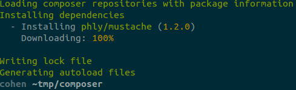

# Build your own Microframework!

Matthew Weier O'Phinney

code|works, Madison, WI

6 December 2012

.fx: titleslide

---

# or, Don't Sweat the Hard Stuff

.fx: titleslide

---

# I am...

* Matthew Weier O'Phinney
* Project Lead, Zend Framework
* Midwest resident (Sioux Falls)
* @weierophinney
* http://mwop.net/

---

# Context is King: MicroPHP

---

# Micro *what?*

- build small, single-purpose libraries
- use small things that work together to solve larger problems
- *Basically, it's the Unix philosophy*, applied to PHP

---

# What are Microframeworks?

---

# The Grand-daddy: Sinatra

    !ruby
    get '/hello/:name' do [n]
        "Hello #{n}!"
    end

    post '/address'
        # create address
    end

    get '/feed.?:format?', :provides => ['rss', 'atom'] do
        builder :feed
    end

# Presenter Notes

- Ruby library, with route notation borrowed from Rails
- DSL, mapping HTTP method and URI to code handling it
- Relies on fact that Ruby uses last value of a block as return value

---

# Breaking it down

- What are the entry points (URIs) for the application?
- What needs to be done for each entry point?

---

# Put another way

- Routing
- Controllers

---

# Why Microframeworks?

---

# Prototyping

# Presenter Notes

- Wanting to test out presentation
- Limited number of pages, with limited dynamic elements

---

# (Mostly) Static Sites

# Presenter Notes

- Small, finite number of URLs
- Basically simplifies the process of taking content and injecting it in a
  layout of some sort

---

# APIs

# Presenter Notes

- Web services need to be **fast**
- Web services often have **specialized and rigid rendering needs**
- Web services usually have **limited endpoints**

---

# Adapting legacy code

# Presenter Notes

- Adapter legacy code to MVC paradigms
- Use legacy code to power APIs
- etc...

---

# Approaches

---

# Procedural style

    !php
    get('/hello/:name', function ($n) {
        return "Hello {$n}!";
    });

    post('/address', function () {
        // create address
    });

    get('/feed.?:format?', function ($feed, $format) {
        return builder($feed, $format);
    });

# Presenter Notes

- **ASK**: what are the pros and cons the attendees see?
- global namespace, but doesn't have to be
- no concept of application state
- makes altering workflow or internals difficult

---

# OOP style

    !php
    $app->get('/hello/:name', function ($n) {
        return "Hello {$n}!";
    });

    $app->post('/address', function () {
        // create address
    });

    $app->get('/feed.?:format?', 
        function ($feed, $format) use ($app) {
            return $app->builder($feed, $format);
        }
    );

# Presenter Notes

- **ASK**: what are the pros and cons the attendees see? How does this improve
  over the previous example?
- Encapsulation
- Ability to have state by currying the `$app`
- allows playing nicely inside namespaces
- pretty much the same, though

---

# Considerations

# Presenter Notes

- We've been looking at the basics: routing and controllers.
- What about arguments, though? in particular, wildcard arguments?
    - especially **performance** - matching parameters to methods can be
      problematic
- or route constraints?

---

# Controller Arguments

Single value object passed to controllers

    !php
    $app->get('/feed.:format', function ($params) {
        $format = $params['format'];
        // do some work ...
    });

# Presenter Notes

- Easiest to implement
- What about default values?

---

# Controller Arguments (2)

Pass the `$app` to the controller

    !php
    $app->get('/feed.:format', function ($app) {
        $format = $app->params('format', 'DefaultValue?');
        // do some work ...
    });

# Presenter Notes

- Next easiest to implement
- Also gives us access to application state, which could be interesting

---

# Controller Arguments (3)

Curry the `$app` into the controller

    !php
    $app->get('/feed.:format', function () use ($app) {
        $format = $app->params('format', 'DefaultValue?');
        // do some work ...
    });

# Presenter Notes

- Pretty much the same as previous, but lets us choose whether or not we need to
  access the `$app`.
- Less predictable
- Will only work if the callback is a closure

---

# Route Constraints and Metadata

- Sometimes you need to validate placeholders
- What if you want the same route for multiple HTTP methods?
- You may want to *name* your routes, to access them later

---

# Route Constraints and Metadata

Return an object on creation, and manipulate it

    !php
    $app->get('/feed.:format', function ($app) {
        // do some work ...
    })->constraints(['format' => '/^(atom|json)$/'])
      ->via('get', 'post') // choose multiple methods!
      ->name('feed');

---

# Helpers

- Route-based URL generation (link elsewhere in your application)
- Redirection
- Flash messages
- Logging (make debugging easier, or audit your application)
- View rendering (don't hand-code markup generation in your controllers)
- Events (alter the workflow)

# Presenter Notes

- Ask if they can think of other things we might want to add

---

# Helpers: Examples

    !php
    // URL generation
    $url = $app->urlFor('feed', ['format' => 'json']);

    // Redirection
    $app->redirect($url);

    // Events
    $app->trigger('update', $app->params()->getParams());

    // Views
    return $app->render('pages/foo');

# Presenter Notes

- Helpers are typically either global functions, or methods of the application
    - They often delegate to composed objects
- Terse usage

---

# It's looking kind of hard now

# Presenter Notes

- It should. Writing a framework isn't really that easy.
- How much of what we saw *already exists elsewhere*, though?

---

# Build on the shoulders of giants

---

# Well, other developers, at the least

---

# Back to MicroPHP

> Use small things that work together to solve larger problems.

# Presenter Notes

- This is the real point I want to get across
- Don't build all this yourself. Build it using the work of others

---

# Composer

# Presenter Notes

- Composer is for managing the *dependencies* of a *project*
- Composer is for providing *autoloading* for the code it manages

---

# Getting Composer

    !bash
    curl -s https://getcomposer.org/installer \
    > -o installer.php
    php installer.php

# Presenter Notes

- Show getcomposer.org
- Show packagist.org

---

# Find Packages

packagist.org

---

# Configuring a project

Create `composer.json`

    !javascript
    {
        "require": {
            "php": ">=5.3.3",
            "phly/mustache": ">=1.2.0"
        }
    }

---

# Installing dependencies

    !bash
    php composer.phar install

# Presenter Notes

- Dependencies are installed in `vendor/` by default
- If any given dependency has dependencies itself, it will install those, too

---

# Routing

---

# Some routing libraries

- `zendframework/zend-mvc` - provides a `Router` subcomponent
- `symfony/routing`
- `aura/router`

# Presenter Notes

- Most of these provide both the ability to match a route, as well as to
  generate a URL based on a route
- Typically, these also require buying in to a concept of a "request" and a
  "response" object

--- 

# HTTP Negotiation

# Presenter Notes

- What?
    - You need to encapsulate the request and response. It makes things
      testable, and also provides you with an OOP way to interact with these
      responsibilities

---

# Some HTTP libraries

- `zendframework/zend-http`
- `symfony/http-kernel`
- `aura/http`

# Presenter Notes

- You'll typically choose based on the routing library you choose
- Symfony HTTP kernel has been getting a lot of adoption in CMS systems lately

---

# View Rendering

---

# Some view rendering libraries

- `zendframework/zend-view`
- `twig/twig`
- `phly/mustache`
- `json_encode()`...

# Presenter Notes

- Typically, you'll choose the rendering library based on how you want to write
  your presentation layer. If you want to use PHP, choose `Zend\View` or
  `aura/view`; Twig is a nice, full-featured templating engine; mustache is
  useful in particular if you're also using it in your client-side logic; etc.
- *You may not need a view layer* -- e.g., if you're writing APIs!

---

# Example: phlyty

Dependencies:

    !javascript
    {
        "require": {
            "php": ">=5.4.0",
            "zendframework/zend-escaper": "2.0.*",
            "zendframework/zend-eventmanager": "2.0.*",
            "zendframework/zend-http": "2.0.*",
            "zendframework/zend-i18n": "2.0.*",
            "zendframework/zend-log": "2.0.*",
            "zendframework/zend-mvc": "2.0.*",
            "zendframework/zend-session": "2.0.*",
            "phly/mustache": ">=1.2.0",
    }

---

# Example: phlyty

Hello, World:

    !php
    use Phlyty\App;
    include 'vendor/autoload.php';

    $app = new App();
    $app->get('/', function ($app) {
        echo "Hello, world!";
    });

    $app->run();

# Presenter Notes

- Obligatory "hello world"

---

# Example: phlyty

Features:

- router params, request, and response encapsulation
- flash messenger, url generation, redirection, logging, and events
- `pass()` on to next matching route, `stop()`, or `halt()`
- render templates and/or view models

---

# Takeaways

- Microframeworks are fun, and have specific use cases

---

# Takeaways

- Don't write the whole thing yourself
    - Build on top of other libraries

---

# Takeaways

- (Typically) Don't write large projects in a microframework

# Presenter Notes

- Most are not engineered to provide practices around organizing large code
  bases.
- In most cases, you'll be instantiating controllers on every request, leading
  to increasing overhead for each endpoint you create.

---

# Some microframeworks to look into

- Horde Routes (http://dev.horde.org/routes)
- SlimPHP (http://www.slimframework.com/)
- Limonade (http://limonade-php.github.com/)
- Silex (http://silex.sensiolabs.org/)
- Phlyty (https://github.com/weierophinney/phlyty)

---

# Resources

- Composer (http://getcomposer.org/)
    - Packagist (http://packagist.org/)
- Pyrus (http://pear2.php.net/)

---

# Thank you

- @weierophinney
- http://joind.in/7103
